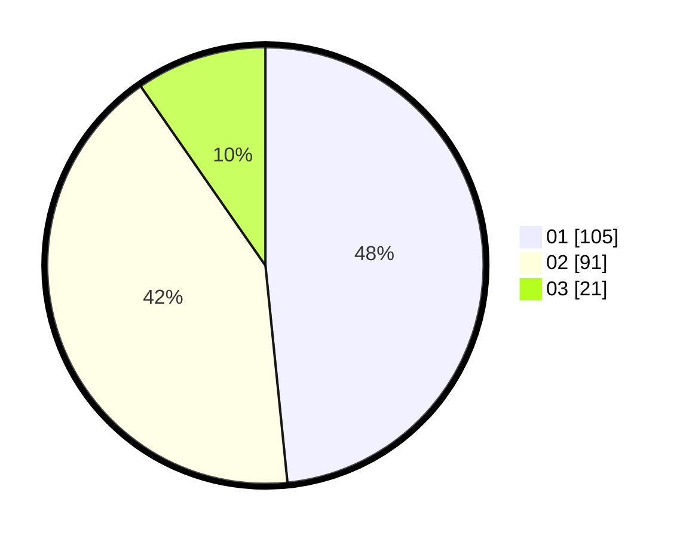

# Hasil

Hasil perolehan suara paslon dapat dilihat pada file paslon-01.txt, paslon-02.txt, dan paslon-03.txt.

Jika tidak ada, artinya data tersebut belum ada pada SIREKAP.

## Perolehan Suara

 * Paslon 01: **105**.
 * Paslon 02: **91**.
 * Paslon 03: **21**.

## Foto C Plano

https://sirekap-obj-formc.kpu.go.id/a3f6/pemilu/ppwp/31/75/04/10/04/3175041004042-20240216-142316--57e85bd7-e545-40f8-a3dc-db3983cc69b3.jpg

https://sirekap-obj-formc.kpu.go.id/a3f6/pemilu/ppwp/31/75/04/10/04/3175041004042-20240216-142318--05a053cf-3d73-4b61-b414-20a1eccbff39.jpg

https://sirekap-obj-formc.kpu.go.id/a3f6/pemilu/ppwp/31/75/04/10/04/3175041004042-20240216-142317--e359a783-51a7-4db7-8769-91b376f1b8ec.jpg

## DATA PEMILIH TETAP

Jumlah pemilih dalam DPT: **271**.
 * L: **129**.
 * P: **142**.

## DATA PENGGUNA HAK PILIH

Jumlah pengguna hak pilih dalam DPT: **218**.
 * L: **96**.
 * P: **122**.

Jumlah pengguna hak pilih dalam DPTb: **0**.
 * L: **0**.
 * P: **0**.

Jumlah pengguna hak pilih dalam DPK: **0**.
 * L: **0**.
 * P: **0**.

Jumlah pengguna hak pilih: **218**.
 * L: **96**.
 * P: **122**.

## JUMLAH SUARA SAH DAN TIDAK SAH

JUMLAH SELURUH SUARA SAH: **217**.

JUMLAH SUARA TIDAK SAH: **1**.

JUMLAH SELURUH SUARA SAH DAN SUARA TIDAK SAH: **218**.
