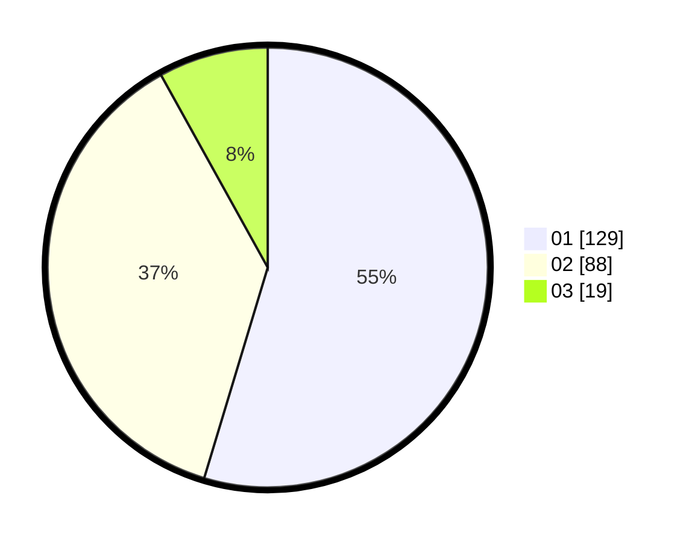

# Hasil

Hasil perolehan suara paslon dapat dilihat pada file paslon-01.txt, paslon-02.txt, dan paslon-03.txt.

Jika tidak ada, artinya data tersebut belum ada pada SIREKAP.

## Perolehan Suara

 * Paslon 01: **129**.
 * Paslon 02: **88**.
 * Paslon 03: **19**.

## Foto C Plano

https://sirekap-obj-formc.kpu.go.id/e7eb/pemilu/ppwp/31/75/04/10/04/3175041004051-20240214-204413--cd5b23d9-8d00-4dea-96b8-aa1e7e7efa0f.jpg

https://sirekap-obj-formc.kpu.go.id/e7eb/pemilu/ppwp/31/75/04/10/04/3175041004051-20240214-204305--3b88bf96-f2c5-4327-adcc-fdb4286b2581.jpg

https://sirekap-obj-formc.kpu.go.id/e7eb/pemilu/ppwp/31/75/04/10/04/3175041004051-20240214-204401--a1a63e19-e08e-4dab-9bc9-46c05b48de88.jpg

## DATA PEMILIH TETAP

Jumlah pemilih dalam DPT: **277**.
 * L: **135**.
 * P: **142**.

## DATA PENGGUNA HAK PILIH

Jumlah pengguna hak pilih dalam DPT: **237**.
 * L: **112**.
 * P: **125**.

Jumlah pengguna hak pilih dalam DPTb: **4**.
 * L: **3**.
 * P: **1**.

Jumlah pengguna hak pilih dalam DPK: **0**.
 * L: **0**.
 * P: **0**.

Jumlah pengguna hak pilih: **241**.
 * L: **115**.
 * P: **126**.

## JUMLAH SUARA SAH DAN TIDAK SAH

JUMLAH SELURUH SUARA SAH: **236**.

JUMLAH SUARA TIDAK SAH: **5**.

JUMLAH SELURUH SUARA SAH DAN SUARA TIDAK SAH: **241**.
