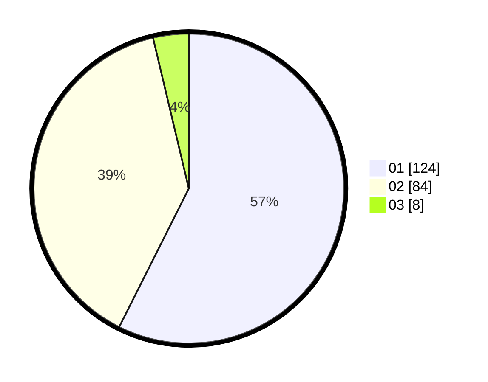

# Hasil

Hasil perolehan suara paslon dapat dilihat pada file paslon-01.txt, paslon-02.txt, dan paslon-03.txt.

Jika tidak ada, artinya data tersebut belum ada pada SIREKAP.

## Perolehan Suara

 * Paslon 01: **124**.
 * Paslon 02: **84**.
 * Paslon 03: **8**.

## Foto C Plano

https://sirekap-obj-formc.kpu.go.id/d51a/pemilu/ppwp/31/75/04/10/04/3175041004053-20240214-204723--8f615704-bc9f-4123-8e2b-478a9f19abc5.jpg

https://sirekap-obj-formc.kpu.go.id/d51a/pemilu/ppwp/31/75/04/10/04/3175041004053-20240214-204906--16d7aecd-0b55-4951-8fcb-05aab4111012.jpg

https://sirekap-obj-formc.kpu.go.id/d51a/pemilu/ppwp/31/75/04/10/04/3175041004053-20240214-204927--059db6de-b3d7-465b-84dd-88f084cf84ad.jpg
