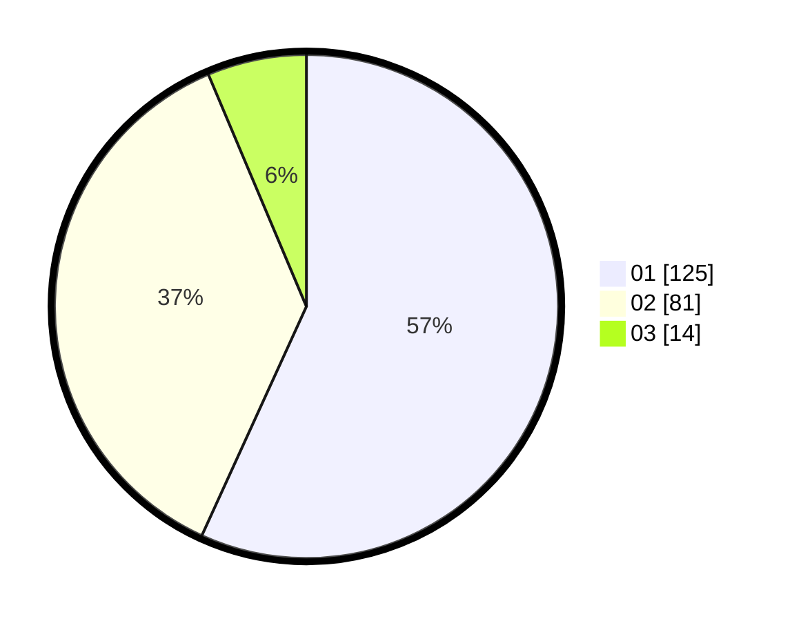

# Hasil

Hasil perolehan suara paslon dapat dilihat pada file paslon-01.txt, paslon-02.txt, dan paslon-03.txt.

Jika tidak ada, artinya data tersebut belum ada pada SIREKAP.

## Perolehan Suara

 * Paslon 01: **125**.
 * Paslon 02: **81**.
 * Paslon 03: **14**.

## Foto C Plano

https://sirekap-obj-formc.kpu.go.id/ba7c/pemilu/ppwp/31/75/04/10/04/3175041004054-20240214-185845--c1fc23b4-6cbb-4ed0-8615-75e87475fc6e.jpg

https://sirekap-obj-formc.kpu.go.id/ba7c/pemilu/ppwp/31/75/04/10/04/3175041004054-20240214-185929--92662d71-de9c-487c-9cbb-2e9e4deb739f.jpg

https://sirekap-obj-formc.kpu.go.id/ba7c/pemilu/ppwp/31/75/04/10/04/3175041004054-20240214-190008--e53d9679-23fe-4ac6-83c9-72c83396352e.jpg

## DATA PEMILIH TETAP

Jumlah pemilih dalam DPT: **270**.
 * L: **135**.
 * P: **135**.

## DATA PENGGUNA HAK PILIH

Jumlah pengguna hak pilih dalam DPT: **217**.
 * L: **100**.
 * P: **117**.

Jumlah pengguna hak pilih dalam DPTb: **2**.
 * L: **1**.
 * P: **1**.

Jumlah pengguna hak pilih dalam DPK: **4**.
 * L: **3**.
 * P: **2**.

Jumlah pengguna hak pilih: **223**.
 * L: **104**.
 * P: **119**.

## JUMLAH SUARA SAH DAN TIDAK SAH

JUMLAH SELURUH SUARA SAH: **220**.

JUMLAH SUARA TIDAK SAH: **3**.

JUMLAH SELURUH SUARA SAH DAN SUARA TIDAK SAH: **223**.
