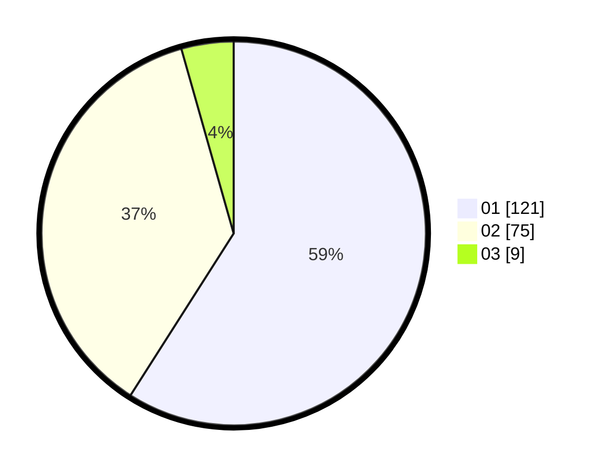

# Hasil

Hasil perolehan suara paslon dapat dilihat pada file paslon-01.txt, paslon-02.txt, dan paslon-03.txt.

Jika tidak ada, artinya data tersebut belum ada pada SIREKAP.

## Perolehan Suara

 * Paslon 01: **121**.
 * Paslon 02: **75**.
 * Paslon 03: **9**.

## Foto C Plano

https://sirekap-obj-formc.kpu.go.id/545c/pemilu/ppwp/31/75/04/10/04/3175041004056-20240214-232922--6317d525-83b3-4b0d-aa91-a76bea64a3c6.jpg

https://sirekap-obj-formc.kpu.go.id/545c/pemilu/ppwp/31/75/04/10/04/3175041004056-20240214-232827--1482e25e-8b8a-44f9-b18a-f5866c61aaf8.jpg

https://sirekap-obj-formc.kpu.go.id/545c/pemilu/ppwp/31/75/04/10/04/3175041004056-20240214-232850--e8e82217-58b4-4e86-bfaa-95c7f9320535.jpg

## DATA PEMILIH TETAP

Jumlah pemilih dalam DPT: **266**.
 * L: **199**.
 * P: **147**.

## DATA PENGGUNA HAK PILIH

Jumlah pengguna hak pilih dalam DPT: **204**.
 * L: **91**.
 * P: **113**.

Jumlah pengguna hak pilih dalam DPTb: **3**.
 * L: **2**.
 * P: **1**.

Jumlah pengguna hak pilih dalam DPK: **0**.
 * L: **0**.
 * P: **0**.

Jumlah pengguna hak pilih: **207**.
 * L: **93**.
 * P: **114**.

## JUMLAH SUARA SAH DAN TIDAK SAH

JUMLAH SELURUH SUARA SAH: **205**.

JUMLAH SUARA TIDAK SAH: **2**.

JUMLAH SELURUH SUARA SAH DAN SUARA TIDAK SAH: **207**.
