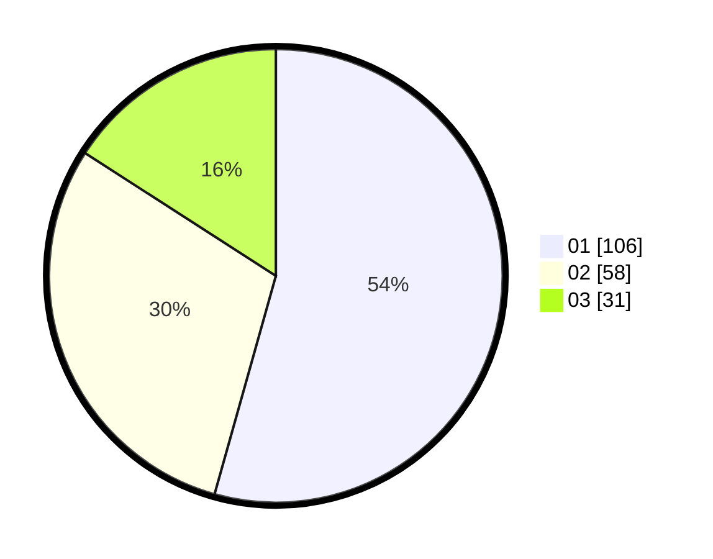

# Hasil

Hasil perolehan suara paslon dapat dilihat pada file paslon-01.txt, paslon-02.txt, dan paslon-03.txt.

Jika tidak ada, artinya data tersebut belum ada pada SIREKAP.

## Perolehan Suara

 * Paslon 01: **106**.
 * Paslon 02: **58**.
 * Paslon 03: **31**.

## Foto C Plano

https://sirekap-obj-formc.kpu.go.id/2bdb/pemilu/ppwp/31/75/04/10/04/3175041004061-20240214-193106--fa2f2a13-62c3-4ac1-897f-2cee26d56587.jpg

https://sirekap-obj-formc.kpu.go.id/2bdb/pemilu/ppwp/31/75/04/10/04/3175041004061-20240214-193145--f030786b-8409-4d14-afb6-8ebf32de71c9.jpg

https://sirekap-obj-formc.kpu.go.id/2bdb/pemilu/ppwp/31/75/04/10/04/3175041004061-20240214-193358--360dc2c0-a083-4151-a77a-cc49ba642a37.jpg

## DATA PEMILIH TETAP

Jumlah pemilih dalam DPT: **258**.
 * L: **133**.
 * P: **125**.

## DATA PENGGUNA HAK PILIH

Jumlah pengguna hak pilih dalam DPT: **192**.
 * L: **91**.
 * P: **101**.

Jumlah pengguna hak pilih dalam DPTb: **6**.
 * L: **3**.
 * P: **3**.

Jumlah pengguna hak pilih dalam DPK: **0**.
 * L: **0**.
 * P: **0**.

Jumlah pengguna hak pilih: **198**.
 * L: **94**.
 * P: **104**.

## JUMLAH SUARA SAH DAN TIDAK SAH

JUMLAH SELURUH SUARA SAH: **195**.

JUMLAH SUARA TIDAK SAH: **3**.

JUMLAH SELURUH SUARA SAH DAN SUARA TIDAK SAH: **198**.
