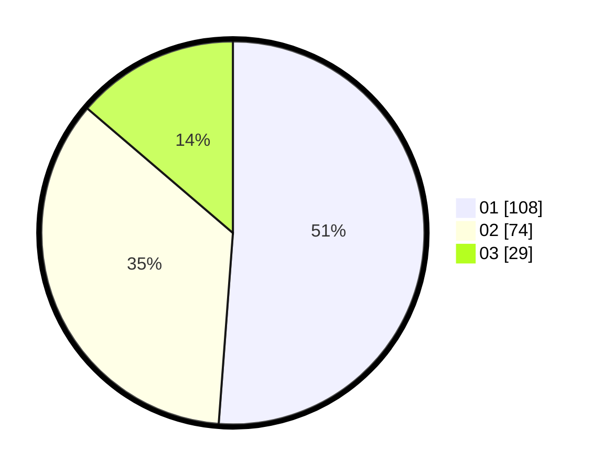

# Hasil

Hasil perolehan suara paslon dapat dilihat pada file paslon-01.txt, paslon-02.txt, dan paslon-03.txt.

Jika tidak ada, artinya data tersebut belum ada pada SIREKAP.

## Perolehan Suara

 * Paslon 01: **108**.
 * Paslon 02: **74**.
 * Paslon 03: **29**.

## Foto C Plano

https://sirekap-obj-formc.kpu.go.id/db17/pemilu/ppwp/31/75/04/10/04/3175041004062-20240214-205323--67aee314-ff8b-4e3b-8280-67876e8e9b85.jpg

https://sirekap-obj-formc.kpu.go.id/db17/pemilu/ppwp/31/75/04/10/04/3175041004062-20240214-205325--725d7611-1c41-4ede-9d11-03954ecefc79.jpg

https://sirekap-obj-formc.kpu.go.id/db17/pemilu/ppwp/31/75/04/10/04/3175041004062-20240214-205329--8790d024-2259-4674-bea1-506f39f5ef90.jpg

## DATA PEMILIH TETAP

Jumlah pemilih dalam DPT: **260**.
 * L: **117**.
 * P: **143**.

## DATA PENGGUNA HAK PILIH

Jumlah pengguna hak pilih dalam DPT: **210**.
 * L: **95**.
 * P: **115**.

Jumlah pengguna hak pilih dalam DPTb: **5**.
 * L: **3**.
 * P: **2**.

Jumlah pengguna hak pilih dalam DPK: **1**.
 * L: **1**.
 * P: **0**.

Jumlah pengguna hak pilih: **216**.
 * L: **99**.
 * P: **117**.

## JUMLAH SUARA SAH DAN TIDAK SAH

JUMLAH SELURUH SUARA SAH: **211**.

JUMLAH SUARA TIDAK SAH: **5**.

JUMLAH SELURUH SUARA SAH DAN SUARA TIDAK SAH: **216**.
