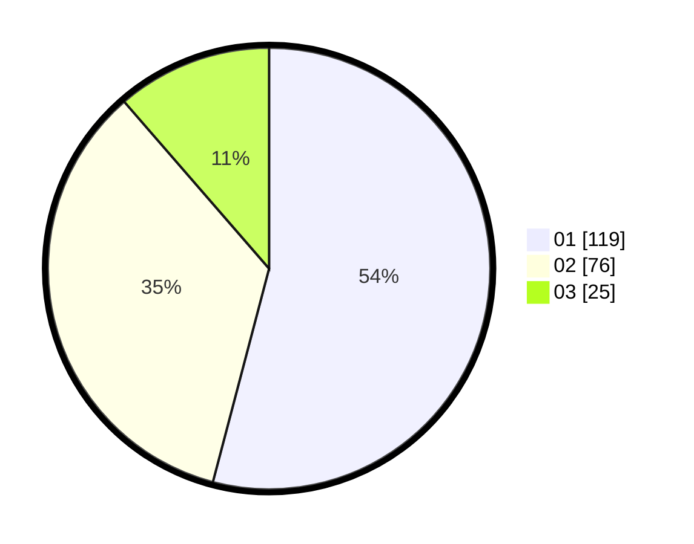

# Hasil

Hasil perolehan suara paslon dapat dilihat pada file paslon-01.txt, paslon-02.txt, dan paslon-03.txt.

Jika tidak ada, artinya data tersebut belum ada pada SIREKAP.

## Perolehan Suara

 * Paslon 01: **119**.
 * Paslon 02: **76**.
 * Paslon 03: **25**.

## Foto C Plano

https://sirekap-obj-formc.kpu.go.id/9692/pemilu/ppwp/31/75/04/10/04/3175041004063-20240214-195025--58719a2a-3baa-48dd-a0d1-c01ba07f9a65.jpg

https://sirekap-obj-formc.kpu.go.id/9692/pemilu/ppwp/31/75/04/10/04/3175041004063-20240214-201901--6f028b83-9189-44d1-bb15-a8e38b2e02c1.jpg

https://sirekap-obj-formc.kpu.go.id/9692/pemilu/ppwp/31/75/04/10/04/3175041004063-20240214-204506--5435e6db-7fe5-48b2-8f9e-2fb33e2b24eb.jpg

## DATA PEMILIH TETAP

Jumlah pemilih dalam DPT: **278**.
 * L: **135**.
 * P: **143**.

## DATA PENGGUNA HAK PILIH

Jumlah pengguna hak pilih dalam DPT: **212**.
 * L: **103**.
 * P: **109**.

Jumlah pengguna hak pilih dalam DPTb: **10**.
 * L: **5**.
 * P: **5**.

Jumlah pengguna hak pilih dalam DPK: **0**.
 * L: **0**.
 * P: **0**.

Jumlah pengguna hak pilih: **222**.
 * L: **108**.
 * P: **114**.

## JUMLAH SUARA SAH DAN TIDAK SAH

JUMLAH SELURUH SUARA SAH: **220**.

JUMLAH SUARA TIDAK SAH: **2**.

JUMLAH SELURUH SUARA SAH DAN SUARA TIDAK SAH: **222**.
