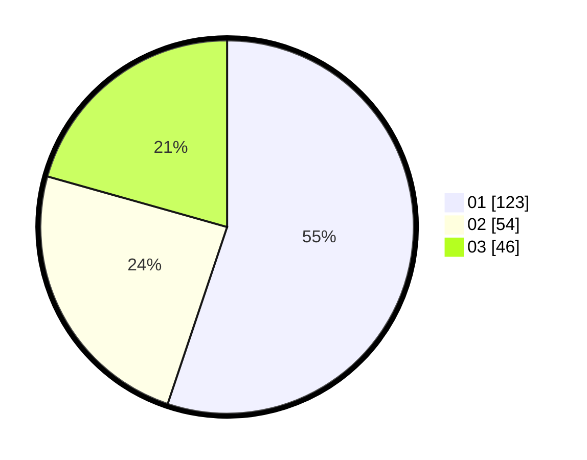

# Hasil

Hasil perolehan suara paslon dapat dilihat pada file paslon-01.txt, paslon-02.txt, dan paslon-03.txt.

Jika tidak ada, artinya data tersebut belum ada pada SIREKAP.

## Perolehan Suara

 * Paslon 01: **123**.
 * Paslon 02: **54**.
 * Paslon 03: **46**.

## Foto C Plano

https://sirekap-obj-formc.kpu.go.id/ca21/pemilu/ppwp/31/75/04/10/04/3175041004066-20240214-203031--6d1066f8-ad7a-422d-96c2-45c7a94a8a95.jpg

https://sirekap-obj-formc.kpu.go.id/ca21/pemilu/ppwp/31/75/04/10/04/3175041004066-20240214-225615--0941fca4-b63d-4b3f-bf58-a24ae8261806.jpg

https://sirekap-obj-formc.kpu.go.id/ca21/pemilu/ppwp/31/75/04/10/04/3175041004066-20240214-203113--d0a3278b-d298-42e0-84c5-72d7a33e9caf.jpg
