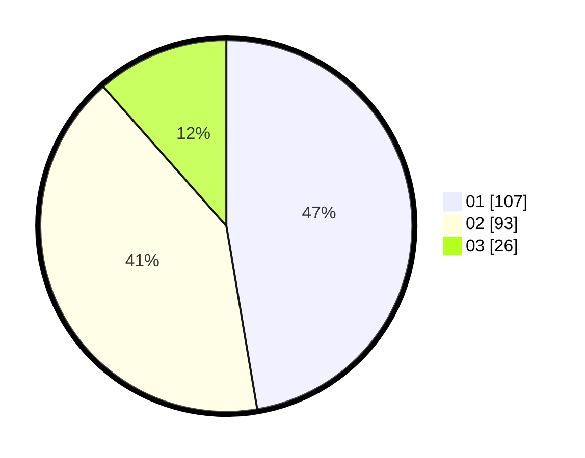

# Hasil

Hasil perolehan suara paslon dapat dilihat pada file paslon-01.txt, paslon-02.txt, dan paslon-03.txt.

Jika tidak ada, artinya data tersebut belum ada pada SIREKAP.

## Perolehan Suara

 * Paslon 01: **107**.
 * Paslon 02: **93**.
 * Paslon 03: **26**.

## Foto C Plano

https://sirekap-obj-formc.kpu.go.id/7551/pemilu/ppwp/31/75/04/10/04/3175041004080-20240216-134217--aca60cfe-ee07-4540-8edf-be474dd7c5e6.jpg

https://sirekap-obj-formc.kpu.go.id/7551/pemilu/ppwp/31/75/04/10/04/3175041004080-20240216-134218--1b8c47ca-af7c-4a36-9795-f7a72ba99f21.jpg

https://sirekap-obj-formc.kpu.go.id/7551/pemilu/ppwp/31/75/04/10/04/3175041004080-20240216-134218--2754d4d6-694b-4f29-aa4e-16ef57be772c.jpg

## DATA PEMILIH TETAP

Jumlah pemilih dalam DPT: **276**.
 * L: **133**.
 * P: **143**.

## DATA PENGGUNA HAK PILIH

Jumlah pengguna hak pilih dalam DPT: **222**.
 * L: **105**.
 * P: **117**.

Jumlah pengguna hak pilih dalam DPTb: **5**.
 * L: **3**.
 * P: **2**.

Jumlah pengguna hak pilih dalam DPK: **5**.
 * L: **3**.
 * P: **2**.

Jumlah pengguna hak pilih: **232**.
 * L: **111**.
 * P: **121**.

## JUMLAH SUARA SAH DAN TIDAK SAH

JUMLAH SELURUH SUARA SAH: **226**.

JUMLAH SUARA TIDAK SAH: **6**.

JUMLAH SELURUH SUARA SAH DAN SUARA TIDAK SAH: **232**.
