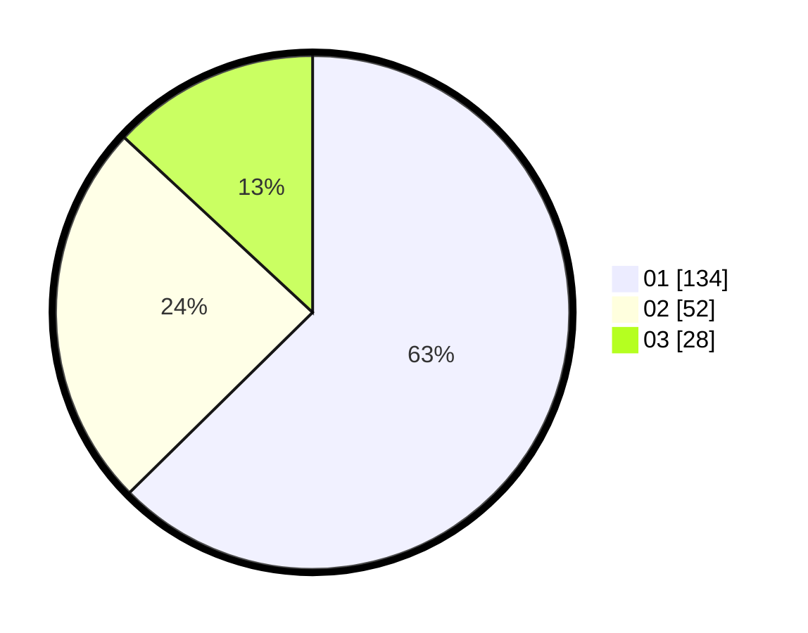

# Hasil

Hasil perolehan suara paslon dapat dilihat pada file paslon-01.txt, paslon-02.txt, dan paslon-03.txt.

Jika tidak ada, artinya data tersebut belum ada pada SIREKAP.

## Perolehan Suara

 * Paslon 01: **134**.
 * Paslon 02: **52**.
 * Paslon 03: **28**.

## Foto C Plano

https://sirekap-obj-formc.kpu.go.id/389a/pemilu/ppwp/31/75/04/10/04/3175041004083-20240214-235544--c4e4b8dd-43fb-4e11-9221-ce11fad4f3ce.jpg

https://sirekap-obj-formc.kpu.go.id/389a/pemilu/ppwp/31/75/04/10/04/3175041004083-20240214-235837--66f36a10-b684-4dd7-93e3-e97eb60df526.jpg

https://sirekap-obj-formc.kpu.go.id/389a/pemilu/ppwp/31/75/04/10/04/3175041004083-20240214-193957--3e81f4fe-3cc6-4ad2-860f-38f436b2a073.jpg
