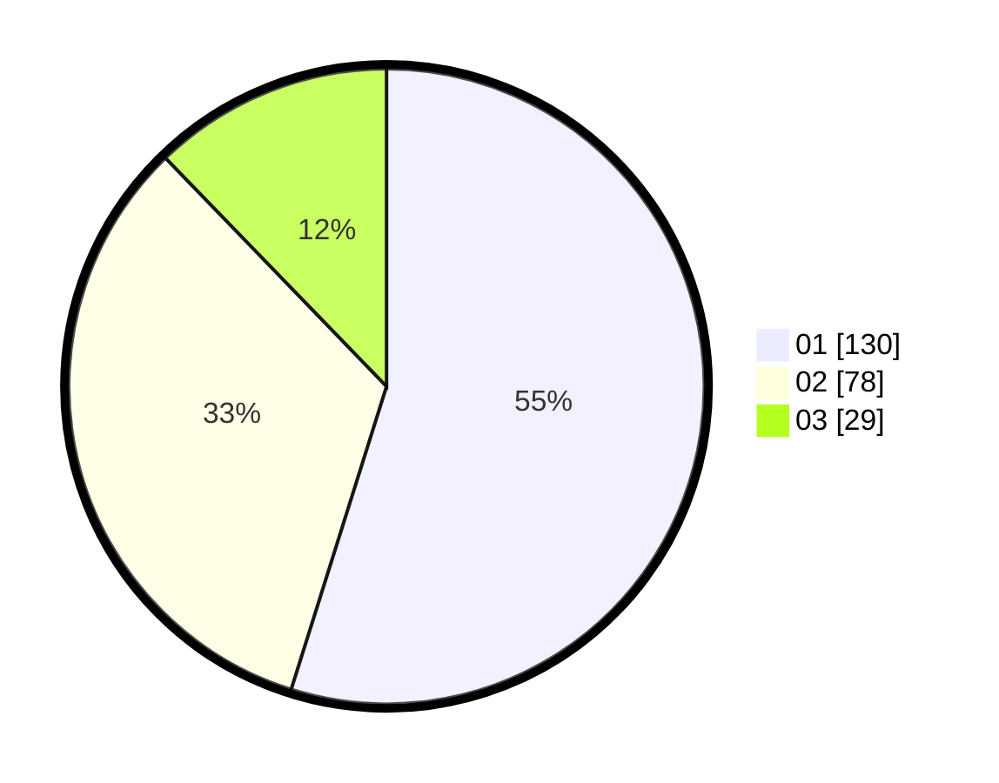

# Hasil

Hasil perolehan suara paslon dapat dilihat pada file paslon-01.txt, paslon-02.txt, dan paslon-03.txt.

Jika tidak ada, artinya data tersebut belum ada pada SIREKAP.

## Perolehan Suara

 * Paslon 01: **130**.
 * Paslon 02: **78**.
 * Paslon 03: **29**.

## Foto C Plano

https://sirekap-obj-formc.kpu.go.id/79a5/pemilu/ppwp/31/75/04/10/04/3175041004084-20240214-155804--cf9c4aeb-c2b4-4ea1-8280-4f88738a53bd.jpg

https://sirekap-obj-formc.kpu.go.id/79a5/pemilu/ppwp/31/75/04/10/04/3175041004084-20240214-155407--56f7b96c-4d0c-43e0-8310-314ae536ee18.jpg

https://sirekap-obj-formc.kpu.go.id/79a5/pemilu/ppwp/31/75/04/10/04/3175041004084-20240214-155631--4fe46ab6-4d1c-47e9-9b5a-d3755cfbfbce.jpg
