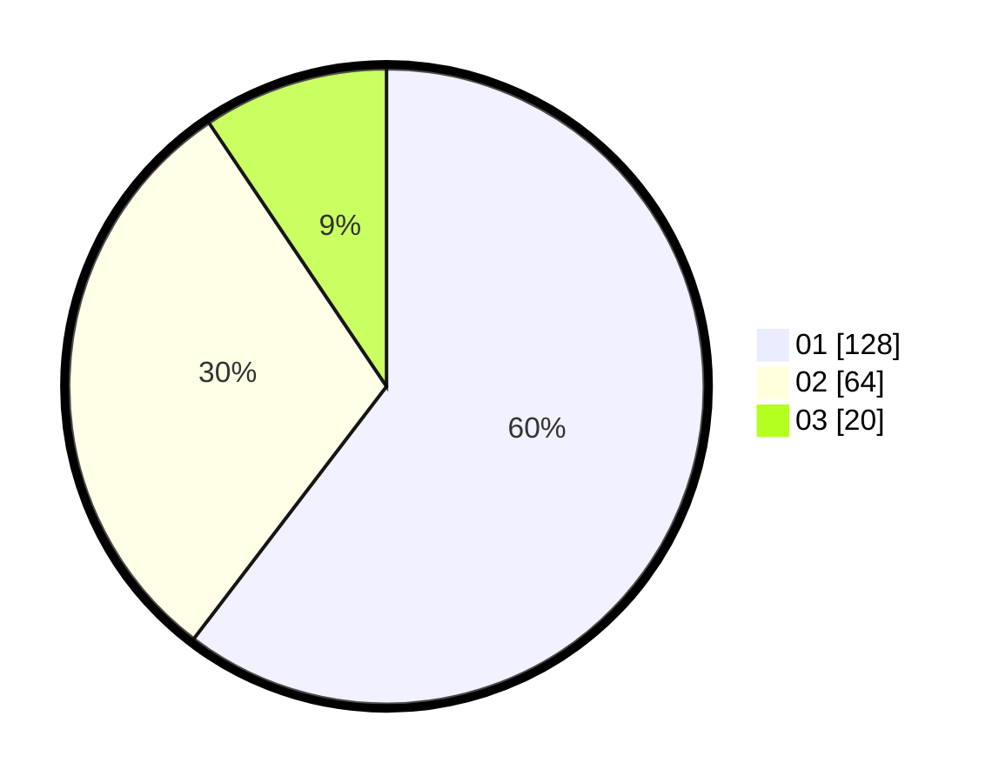

# Hasil

Hasil perolehan suara paslon dapat dilihat pada file paslon-01.txt, paslon-02.txt, dan paslon-03.txt.

Jika tidak ada, artinya data tersebut belum ada pada SIREKAP.

## Perolehan Suara

 * Paslon 01: **128**.
 * Paslon 02: **64**.
 * Paslon 03: **20**.

## Foto C Plano

https://sirekap-obj-formc.kpu.go.id/9216/pemilu/ppwp/31/75/04/10/04/3175041004090-20240214-222848--ed370557-487a-40f3-9704-de520d8645bc.jpg

https://sirekap-obj-formc.kpu.go.id/9216/pemilu/ppwp/31/75/04/10/04/3175041004090-20240214-222942--d0c37ff4-26b4-44e6-8fec-25403c7ecdaa.jpg

https://sirekap-obj-formc.kpu.go.id/9216/pemilu/ppwp/31/75/04/10/04/3175041004090-20240214-223033--aacc8dc5-7e36-4fd3-908e-8bd427a2ebb5.jpg

## DATA PEMILIH TETAP

Jumlah pemilih dalam DPT: **272**.
 * L: **129**.
 * P: **143**.

## DATA PENGGUNA HAK PILIH

Jumlah pengguna hak pilih dalam DPT: **272**.
 * L: **129**.
 * P: **143**.

Jumlah pengguna hak pilih dalam DPTb: **2**.
 * L: **1**.
 * P: **1**.

Jumlah pengguna hak pilih dalam DPK: **1**.
 * L: **1**.
 * P: **0**.

Jumlah pengguna hak pilih: **275**.
 * L: **131**.
 * P: **144**.

## JUMLAH SUARA SAH DAN TIDAK SAH

JUMLAH SELURUH SUARA SAH: **212**.

JUMLAH SUARA TIDAK SAH: **4**.

JUMLAH SELURUH SUARA SAH DAN SUARA TIDAK SAH: **216**.
