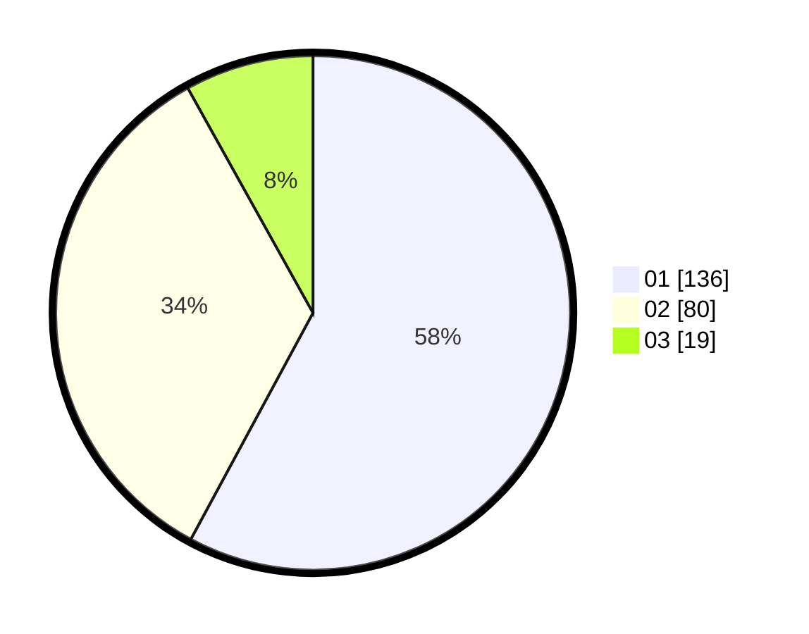

# Hasil

Hasil perolehan suara paslon dapat dilihat pada file paslon-01.txt, paslon-02.txt, dan paslon-03.txt.

Jika tidak ada, artinya data tersebut belum ada pada SIREKAP.

## Perolehan Suara

 * Paslon 01: **136**.
 * Paslon 02: **80**.
 * Paslon 03: **19**.

## Foto C Plano

https://sirekap-obj-formc.kpu.go.id/cf37/pemilu/ppwp/31/75/04/10/04/3175041004091-20240214-215955--26eb5cbf-e950-4994-8720-fd8f1201fd33.jpg

https://sirekap-obj-formc.kpu.go.id/cf37/pemilu/ppwp/31/75/04/10/04/3175041004091-20240214-220036--6e845232-231c-4b4a-ae2f-a334d9aa327c.jpg

https://sirekap-obj-formc.kpu.go.id/cf37/pemilu/ppwp/31/75/04/10/04/3175041004091-20240214-220131--131af36c-62c1-4cb9-8cf4-7069f8c0ab7c.jpg

## DATA PEMILIH TETAP

Jumlah pemilih dalam DPT: **273**.
 * L: **126**.
 * P: **147**.

## DATA PENGGUNA HAK PILIH

Jumlah pengguna hak pilih dalam DPT: **233**.
 * L: **106**.
 * P: **127**.

Jumlah pengguna hak pilih dalam DPTb: **0**.
 * L: **0**.
 * P: **0**.

Jumlah pengguna hak pilih dalam DPK: **3**.
 * L: **1**.
 * P: **2**.

Jumlah pengguna hak pilih: **236**.
 * L: **107**.
 * P: **129**.

## JUMLAH SUARA SAH DAN TIDAK SAH

JUMLAH SELURUH SUARA SAH: **235**.

JUMLAH SUARA TIDAK SAH: **1**.

JUMLAH SELURUH SUARA SAH DAN SUARA TIDAK SAH: **236**.
