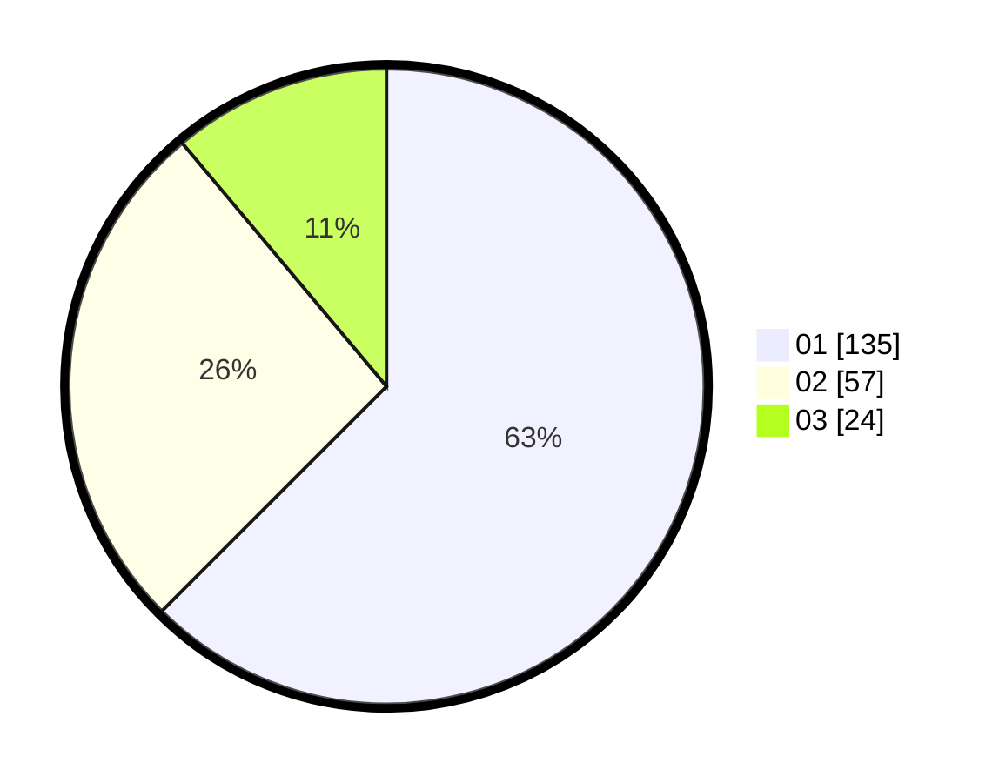

# Hasil

Hasil perolehan suara paslon dapat dilihat pada file paslon-01.txt, paslon-02.txt, dan paslon-03.txt.

Jika tidak ada, artinya data tersebut belum ada pada SIREKAP.

## Perolehan Suara

 * Paslon 01: **135**.
 * Paslon 02: **57**.
 * Paslon 03: **24**.

## Foto C Plano

https://sirekap-obj-formc.kpu.go.id/86a8/pemilu/ppwp/31/75/04/10/04/3175041004108-20240214-230952--467506ff-3721-4ae0-96a4-ef05167689ad.jpg

https://sirekap-obj-formc.kpu.go.id/86a8/pemilu/ppwp/31/75/04/10/04/3175041004108-20240214-231200--b93ef720-288c-49a8-b3f5-7f86fb0ceddb.jpg

https://sirekap-obj-formc.kpu.go.id/86a8/pemilu/ppwp/31/75/04/10/04/3175041004108-20240214-231435--c89cf6ef-052c-4736-bf60-bb2ded375cbb.jpg
