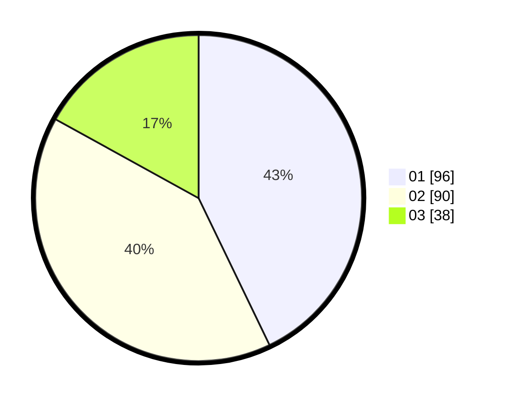

# Hasil

Hasil perolehan suara paslon dapat dilihat pada file paslon-01.txt, paslon-02.txt, dan paslon-03.txt.

Jika tidak ada, artinya data tersebut belum ada pada SIREKAP.

## Perolehan Suara

 * Paslon 01: **96**.
 * Paslon 02: **90**.
 * Paslon 03: **38**.

## Foto C Plano

https://sirekap-obj-formc.kpu.go.id/77b3/pemilu/ppwp/31/75/04/10/04/3175041004120-20240214-205538--8b7f7b7e-bf8e-4694-bdc9-5cfadef93a3a.jpg

https://sirekap-obj-formc.kpu.go.id/77b3/pemilu/ppwp/31/75/04/10/04/3175041004120-20240214-205651--4c18ba9c-d7e5-42ac-86f4-a175119a0c6b.jpg

https://sirekap-obj-formc.kpu.go.id/77b3/pemilu/ppwp/31/75/04/10/04/3175041004120-20240214-205745--9946eb24-256d-4cac-b73c-aa7845df2ed2.jpg

## DATA PEMILIH TETAP

Jumlah pemilih dalam DPT: **278**.
 * L: **135**.
 * P: **143**.

## DATA PENGGUNA HAK PILIH

Jumlah pengguna hak pilih dalam DPT: **222**.
 * L: **101**.
 * P: **121**.

Jumlah pengguna hak pilih dalam DPTb: **3**.
 * L: **1**.
 * P: **2**.

Jumlah pengguna hak pilih dalam DPK: **0**.
 * L: **0**.
 * P: **0**.

Jumlah pengguna hak pilih: **225**.
 * L: **102**.
 * P: **123**.

## JUMLAH SUARA SAH DAN TIDAK SAH

JUMLAH SELURUH SUARA SAH: **224**.

JUMLAH SUARA TIDAK SAH: **1**.

JUMLAH SELURUH SUARA SAH DAN SUARA TIDAK SAH: **225**.
