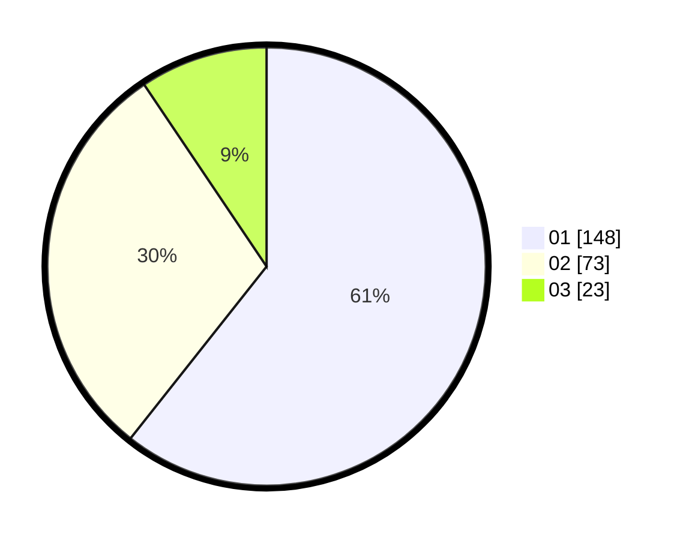

# Hasil

Hasil perolehan suara paslon dapat dilihat pada file paslon-01.txt, paslon-02.txt, dan paslon-03.txt.

Jika tidak ada, artinya data tersebut belum ada pada SIREKAP.

## Perolehan Suara

 * Paslon 01: **148**.
 * Paslon 02: **73**.
 * Paslon 03: **23**.

## Foto C Plano

https://sirekap-obj-formc.kpu.go.id/30c4/pemilu/ppwp/31/75/04/10/04/3175041004121-20240214-155107--3ce5b22f-4c57-431c-b5f5-8f48c23d5237.jpg

https://sirekap-obj-formc.kpu.go.id/30c4/pemilu/ppwp/31/75/04/10/04/3175041004121-20240214-231106--b150de47-98c5-43cb-bff6-dff23e8c71d7.jpg

https://sirekap-obj-formc.kpu.go.id/30c4/pemilu/ppwp/31/75/04/10/04/3175041004121-20240214-155410--afa228a9-2712-41c7-8054-729d3e445730.jpg

## DATA PEMILIH TETAP

Jumlah pemilih dalam DPT: **279**.
 * L: **138**.
 * P: **145**.

## DATA PENGGUNA HAK PILIH

Jumlah pengguna hak pilih dalam DPT: **246**.
 * L: **118**.
 * P: **128**.

Jumlah pengguna hak pilih dalam DPTb: **1**.
 * L: **0**.
 * P: **1**.

Jumlah pengguna hak pilih dalam DPK: **1**.
 * L: **1**.
 * P: **0**.

Jumlah pengguna hak pilih: **248**.
 * L: **119**.
 * P: **129**.

## JUMLAH SUARA SAH DAN TIDAK SAH

JUMLAH SELURUH SUARA SAH: **244**.

JUMLAH SUARA TIDAK SAH: **4**.

JUMLAH SELURUH SUARA SAH DAN SUARA TIDAK SAH: **248**.
