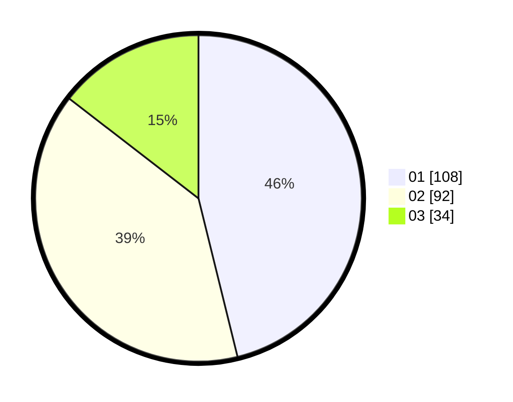

# Hasil

Hasil perolehan suara paslon dapat dilihat pada file paslon-01.txt, paslon-02.txt, dan paslon-03.txt.

Jika tidak ada, artinya data tersebut belum ada pada SIREKAP.

## Perolehan Suara

 * Paslon 01: **108**.
 * Paslon 02: **92**.
 * Paslon 03: **34**.

## Foto C Plano

https://sirekap-obj-formc.kpu.go.id/aae3/pemilu/ppwp/31/75/04/10/04/3175041004123-20240214-204310--a0fe7214-02b1-4914-b760-60288687bf0b.jpg

https://sirekap-obj-formc.kpu.go.id/aae3/pemilu/ppwp/31/75/04/10/04/3175041004123-20240214-204302--f6982f54-27ec-4d6e-80d7-4448d3662bec.jpg

https://sirekap-obj-formc.kpu.go.id/aae3/pemilu/ppwp/31/75/04/10/04/3175041004123-20240215-033034--8c7de6ff-01b6-481d-ad9d-0420207ca23f.jpg

## DATA PEMILIH TETAP

Jumlah pemilih dalam DPT: **268**.
 * L: **131**.
 * P: **137**.

## DATA PENGGUNA HAK PILIH

Jumlah pengguna hak pilih dalam DPT: **235**.
 * L: **111**.
 * P: **124**.

Jumlah pengguna hak pilih dalam DPTb: **0**.
 * L: **0**.
 * P: **0**.

Jumlah pengguna hak pilih dalam DPK: **4**.
 * L: **1**.
 * P: **3**.

Jumlah pengguna hak pilih: **239**.
 * L: **112**.
 * P: **127**.

## JUMLAH SUARA SAH DAN TIDAK SAH

JUMLAH SELURUH SUARA SAH: **234**.

JUMLAH SUARA TIDAK SAH: **4**.

JUMLAH SELURUH SUARA SAH DAN SUARA TIDAK SAH: **238**.
