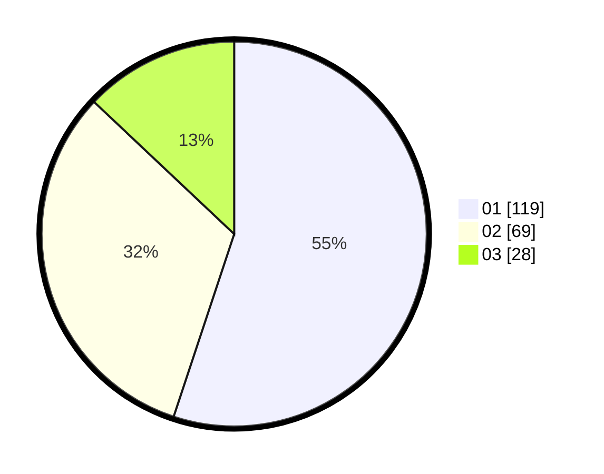

# Hasil

Hasil perolehan suara paslon dapat dilihat pada file paslon-01.txt, paslon-02.txt, dan paslon-03.txt.

Jika tidak ada, artinya data tersebut belum ada pada SIREKAP.

## Perolehan Suara

 * Paslon 01: **119**.
 * Paslon 02: **69**.
 * Paslon 03: **28**.

## Foto C Plano

https://sirekap-obj-formc.kpu.go.id/f2f1/pemilu/ppwp/31/75/04/10/04/3175041004124-20240214-213117--3fac60ac-8af1-49a9-ba82-8b36d2fbcda8.jpg

https://sirekap-obj-formc.kpu.go.id/f2f1/pemilu/ppwp/31/75/04/10/04/3175041004124-20240214-230900--a082f628-c402-403f-9629-83b336e45867.jpg

https://sirekap-obj-formc.kpu.go.id/f2f1/pemilu/ppwp/31/75/04/10/04/3175041004124-20240214-213139--21403e37-692b-4407-bca4-43bf4a960b17.jpg
