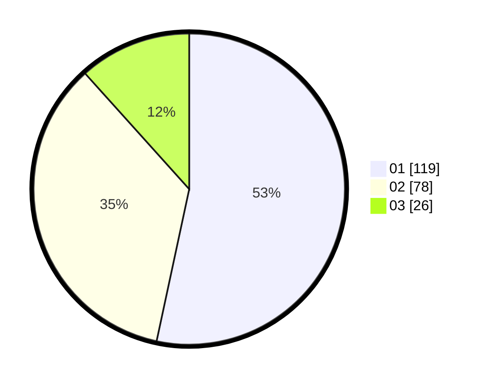

# Hasil

Hasil perolehan suara paslon dapat dilihat pada file paslon-01.txt, paslon-02.txt, dan paslon-03.txt.

Jika tidak ada, artinya data tersebut belum ada pada SIREKAP.

## Perolehan Suara

 * Paslon 01: **119**.
 * Paslon 02: **78**.
 * Paslon 03: **26**.

## Foto C Plano

https://sirekap-obj-formc.kpu.go.id/6e1f/pemilu/ppwp/31/75/04/10/04/3175041004125-20240215-212905--5d9d0b6c-db67-4f4e-945b-cc7a39195652.jpg

https://sirekap-obj-formc.kpu.go.id/6e1f/pemilu/ppwp/31/75/04/10/04/3175041004125-20240215-213103--4d155056-355a-4543-884e-447aa7956562.jpg

https://sirekap-obj-formc.kpu.go.id/6e1f/pemilu/ppwp/31/75/04/10/04/3175041004125-20240215-213241--bcdcb340-2ca7-4686-8739-1b22ebf79076.jpg
