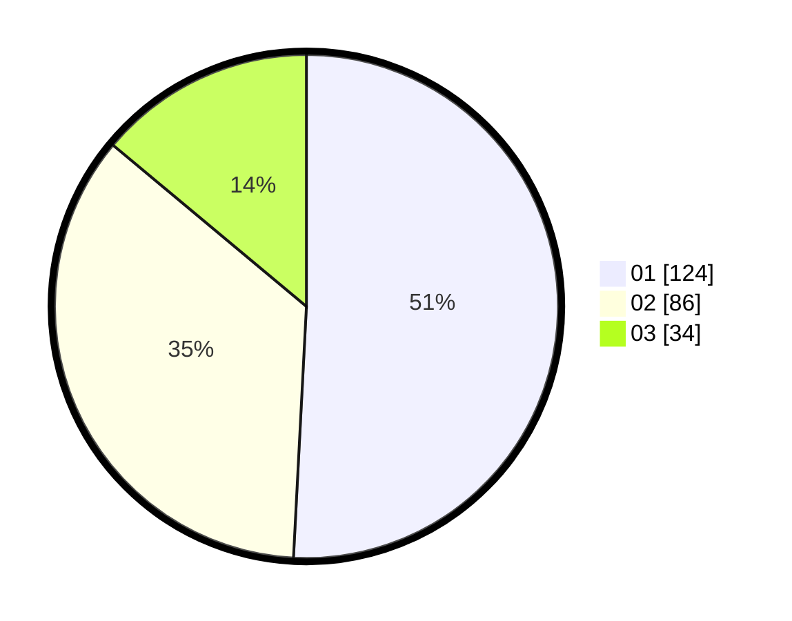

# Hasil

Hasil perolehan suara paslon dapat dilihat pada file paslon-01.txt, paslon-02.txt, dan paslon-03.txt.

Jika tidak ada, artinya data tersebut belum ada pada SIREKAP.

## Perolehan Suara

 * Paslon 01: **124**.
 * Paslon 02: **86**.
 * Paslon 03: **34**.

## Foto C Plano

https://sirekap-obj-formc.kpu.go.id/7e1d/pemilu/ppwp/31/75/04/10/04/3175041004126-20240215-230426--845e7242-40f5-4425-8ae3-1e85e7295878.jpg

https://sirekap-obj-formc.kpu.go.id/7e1d/pemilu/ppwp/31/75/04/10/04/3175041004126-20240215-215802--a12b47fa-31c5-40d9-92ed-533e9d9dc9da.jpg
