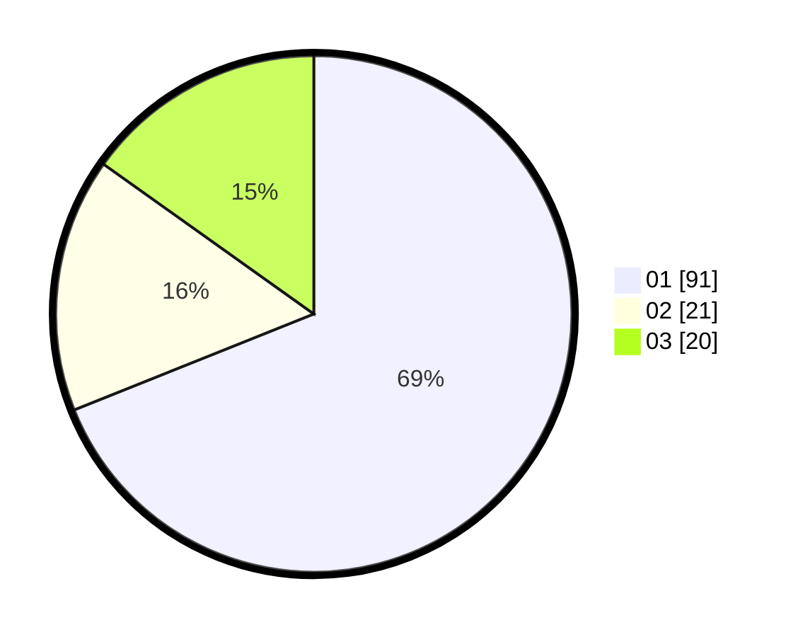

# Hasil

Hasil perolehan suara paslon dapat dilihat pada file paslon-01.txt, paslon-02.txt, dan paslon-03.txt.

Jika tidak ada, artinya data tersebut belum ada pada SIREKAP.

## Perolehan Suara

 * Paslon 01: **91**.
 * Paslon 02: **21**.
 * Paslon 03: **20**.

## Foto C Plano

https://sirekap-obj-formc.kpu.go.id/3124/pemilu/ppwp/31/75/04/10/04/3175041004143-20240214-192522--19816cdc-6d49-4b87-ba0a-b0f5ad390ddb.jpg

https://sirekap-obj-formc.kpu.go.id/3124/pemilu/ppwp/31/75/04/10/04/3175041004143-20240214-192615--b9bfeb56-c9a5-4c29-b816-9300aefe006e.jpg

https://sirekap-obj-formc.kpu.go.id/3124/pemilu/ppwp/31/75/04/10/04/3175041004143-20240214-192653--7e7292bd-630a-4c4a-8e96-f1d640063bdd.jpg
