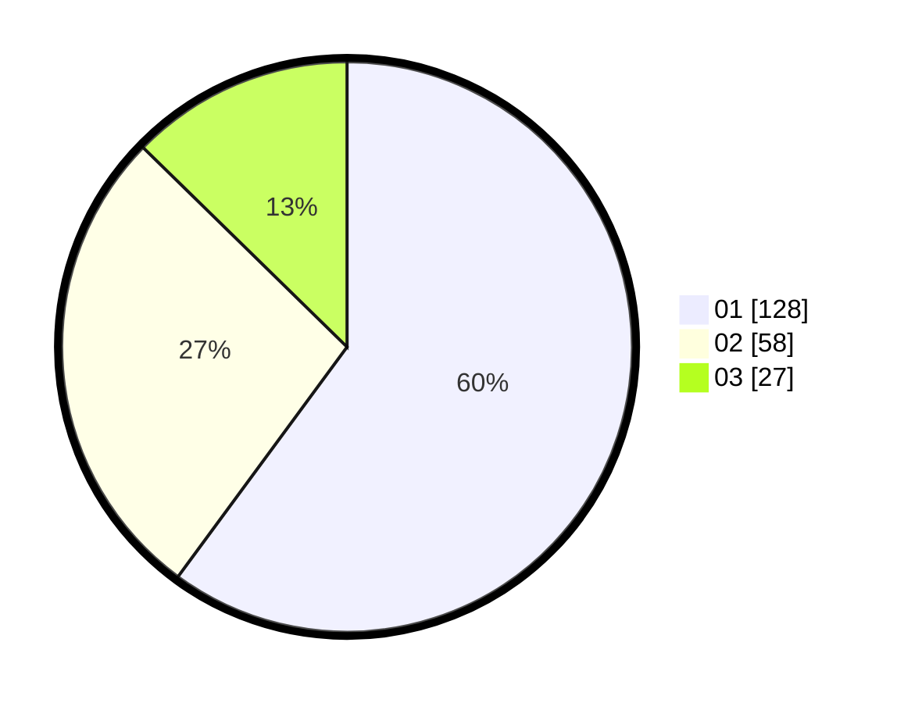

# Hasil

Hasil perolehan suara paslon dapat dilihat pada file paslon-01.txt, paslon-02.txt, dan paslon-03.txt.

Jika tidak ada, artinya data tersebut belum ada pada SIREKAP.

## Perolehan Suara

 * Paslon 01: **128**.
 * Paslon 02: **58**.
 * Paslon 03: **27**.

## Foto C Plano

https://sirekap-obj-formc.kpu.go.id/e6fd/pemilu/ppwp/31/75/04/10/04/3175041004153-20240214-194327--4f791aa4-68b7-48d3-86e8-5c1c43907e77.jpg

https://sirekap-obj-formc.kpu.go.id/e6fd/pemilu/ppwp/31/75/04/10/04/3175041004153-20240214-194346--d213eaed-01f0-40a7-b8a8-b4754a50a930.jpg

https://sirekap-obj-formc.kpu.go.id/e6fd/pemilu/ppwp/31/75/04/10/04/3175041004153-20240214-194400--a318c3de-4870-4495-aee5-6f3301a99603.jpg

## DATA PEMILIH TETAP

Jumlah pemilih dalam DPT: **267**.
 * L: **126**.
 * P: **141**.

## DATA PENGGUNA HAK PILIH

Jumlah pengguna hak pilih dalam DPT: **217**.
 * L: **98**.
 * P: **119**.

Jumlah pengguna hak pilih dalam DPTb: **1**.
 * L: **1**.
 * P: **0**.

Jumlah pengguna hak pilih dalam DPK: **1**.
 * L: **0**.
 * P: **1**.

Jumlah pengguna hak pilih: **219**.
 * L: **99**.
 * P: **120**.

## JUMLAH SUARA SAH DAN TIDAK SAH

JUMLAH SELURUH SUARA SAH: **213**.

JUMLAH SUARA TIDAK SAH: **6**.

JUMLAH SELURUH SUARA SAH DAN SUARA TIDAK SAH: **219**.
