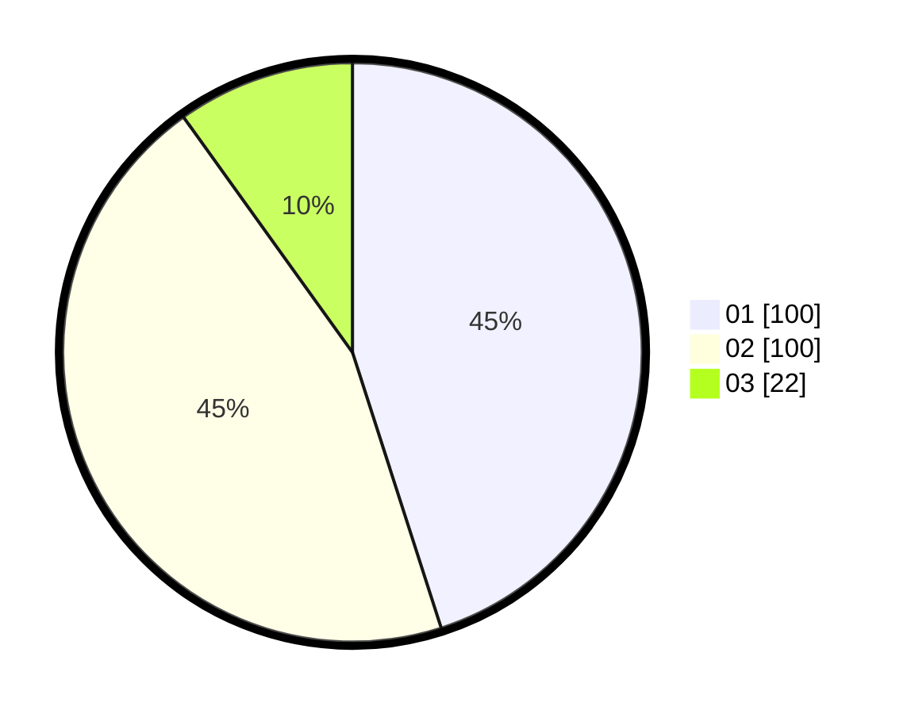

# Hasil

Hasil perolehan suara paslon dapat dilihat pada file paslon-01.txt, paslon-02.txt, dan paslon-03.txt.

Jika tidak ada, artinya data tersebut belum ada pada SIREKAP.

## Perolehan Suara

 * Paslon 01: **100**.
 * Paslon 02: **100**.
 * Paslon 03: **22**.

## Foto C Plano

https://sirekap-obj-formc.kpu.go.id/0f5d/pemilu/ppwp/31/75/04/10/04/3175041004161-20240214-155737--f8f199eb-2ec7-4606-99ec-7e7128c4e724.jpg

https://sirekap-obj-formc.kpu.go.id/0f5d/pemilu/ppwp/31/75/04/10/04/3175041004161-20240214-155847--f5f7932d-5791-4771-96a5-16138e91119b.jpg

https://sirekap-obj-formc.kpu.go.id/0f5d/pemilu/ppwp/31/75/04/10/04/3175041004161-20240214-160113--0df4d045-ac0e-462a-9875-74148dff6f20.jpg
