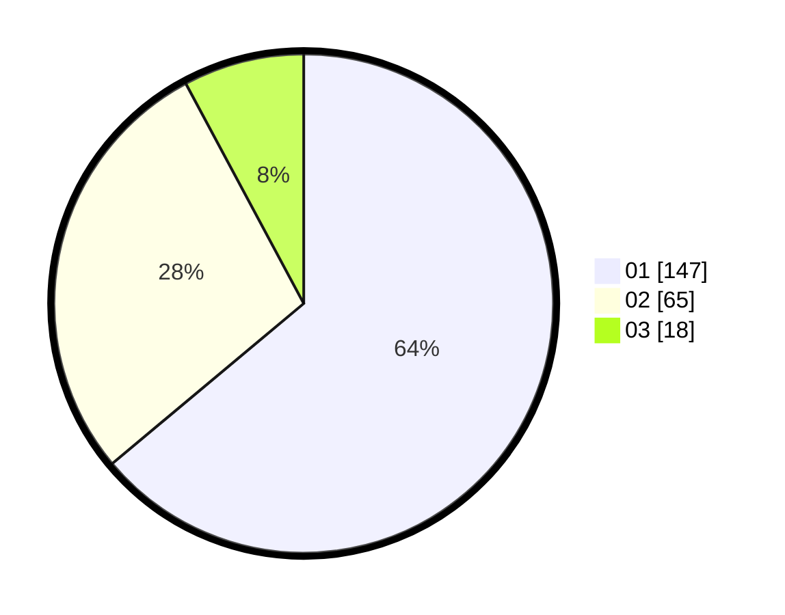

# Hasil

Hasil perolehan suara paslon dapat dilihat pada file paslon-01.txt, paslon-02.txt, dan paslon-03.txt.

Jika tidak ada, artinya data tersebut belum ada pada SIREKAP.

## Perolehan Suara

 * Paslon 01: **147**.
 * Paslon 02: **65**.
 * Paslon 03: **18**.

## Foto C Plano

https://sirekap-obj-formc.kpu.go.id/331b/pemilu/ppwp/31/75/04/10/05/3175041005015-20240214-195929--6e4b18dc-8866-4790-8b59-652a8d6c9f95.jpg

https://sirekap-obj-formc.kpu.go.id/331b/pemilu/ppwp/31/75/04/10/05/3175041005015-20240214-200020--c4f9095e-820a-4529-bb72-198ac41ec032.jpg

https://sirekap-obj-formc.kpu.go.id/331b/pemilu/ppwp/31/75/04/10/05/3175041005015-20240214-193951--b1d4e6cb-d067-4840-b3bc-6579af39410b.jpg

## DATA PEMILIH TETAP

Jumlah pemilih dalam DPT: **292**.
 * L: **154**.
 * P: **138**.

## DATA PENGGUNA HAK PILIH

Jumlah pengguna hak pilih dalam DPT: **232**.
 * L: **117**.
 * P: **115**.

Jumlah pengguna hak pilih dalam DPTb: **0**.
 * L: **0**.
 * P: **0**.

Jumlah pengguna hak pilih dalam DPK: **0**.
 * L: **0**.
 * P: **0**.

Jumlah pengguna hak pilih: **0**.
 * L: **0**.
 * P: **0**.

## JUMLAH SUARA SAH DAN TIDAK SAH

JUMLAH SELURUH SUARA SAH: **230**.

JUMLAH SUARA TIDAK SAH: **2**.

JUMLAH SELURUH SUARA SAH DAN SUARA TIDAK SAH: **232**.
