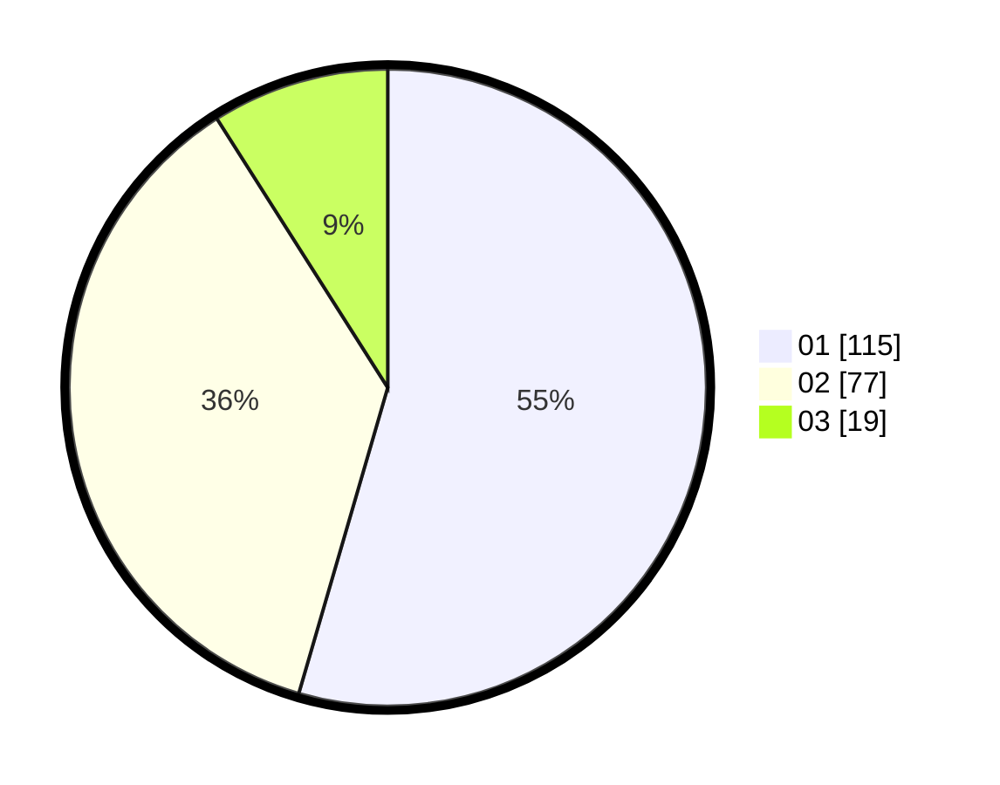

# Hasil

Hasil perolehan suara paslon dapat dilihat pada file paslon-01.txt, paslon-02.txt, dan paslon-03.txt.

Jika tidak ada, artinya data tersebut belum ada pada SIREKAP.

## Perolehan Suara

 * Paslon 01: **115**.
 * Paslon 02: **77**.
 * Paslon 03: **19**.

## Foto C Plano

https://sirekap-obj-formc.kpu.go.id/301d/pemilu/ppwp/31/75/04/10/05/3175041005019-20240218-110534--689f3347-536e-4de2-9ec0-90a77c0193e3.jpg

https://sirekap-obj-formc.kpu.go.id/301d/pemilu/ppwp/31/75/04/10/05/3175041005019-20240218-110629--8bad3c6a-45fc-45ab-bffe-1df50b3bfe7d.jpg

https://sirekap-obj-formc.kpu.go.id/301d/pemilu/ppwp/31/75/04/10/05/3175041005019-20240219-074749--c9dabd2e-b681-4352-9766-b438fcc581bc.jpg
