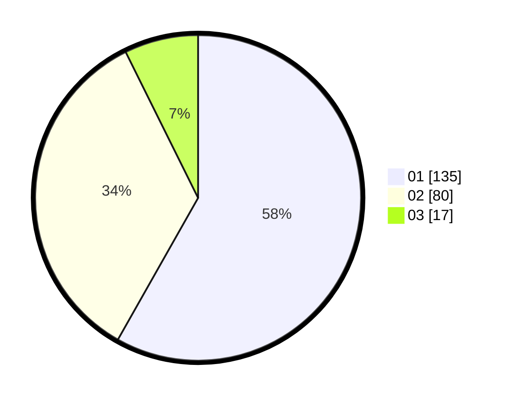

# Hasil

Hasil perolehan suara paslon dapat dilihat pada file paslon-01.txt, paslon-02.txt, dan paslon-03.txt.

Jika tidak ada, artinya data tersebut belum ada pada SIREKAP.

## Perolehan Suara

 * Paslon 01: **135**.
 * Paslon 02: **80**.
 * Paslon 03: **17**.

## Foto C Plano

https://sirekap-obj-formc.kpu.go.id/5159/pemilu/ppwp/31/75/04/10/05/3175041005021-20240214-190718--64f4c226-b2d8-45e0-8d6c-6876e8d9dad9.jpg

https://sirekap-obj-formc.kpu.go.id/5159/pemilu/ppwp/31/75/04/10/05/3175041005021-20240214-193659--f58f8be8-04bd-4426-a6e7-b9cb883d6523.jpg

https://sirekap-obj-formc.kpu.go.id/5159/pemilu/ppwp/31/75/04/10/05/3175041005021-20240214-193741--83326c38-d642-4ae0-9523-53438686ad04.jpg

## DATA PEMILIH TETAP

Jumlah pemilih dalam DPT: **286**.
 * L: **138**.
 * P: **148**.

## DATA PENGGUNA HAK PILIH

Jumlah pengguna hak pilih dalam DPT: **231**.
 * L: **107**.
 * P: **124**.

Jumlah pengguna hak pilih dalam DPTb: **1**.
 * L: **0**.
 * P: **1**.

Jumlah pengguna hak pilih dalam DPK: **0**.
 * L: **0**.
 * P: **0**.

Jumlah pengguna hak pilih: **232**.
 * L: **107**.
 * P: **125**.

## JUMLAH SUARA SAH DAN TIDAK SAH

JUMLAH SELURUH SUARA SAH: **232**.

JUMLAH SUARA TIDAK SAH: **0**.

JUMLAH SELURUH SUARA SAH DAN SUARA TIDAK SAH: **232**.
