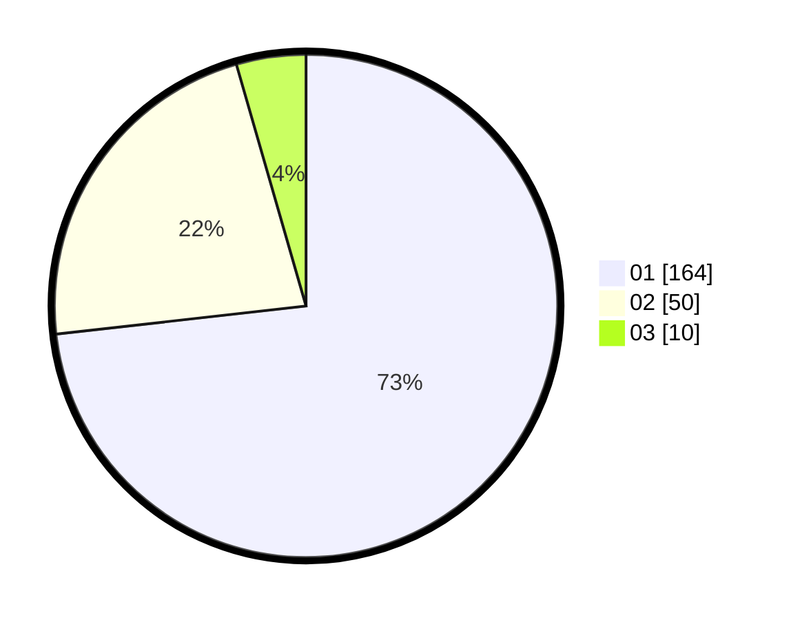

# Hasil

Hasil perolehan suara paslon dapat dilihat pada file paslon-01.txt, paslon-02.txt, dan paslon-03.txt.

Jika tidak ada, artinya data tersebut belum ada pada SIREKAP.

## Perolehan Suara

 * Paslon 01: **164**.
 * Paslon 02: **50**.
 * Paslon 03: **10**.

## Foto C Plano

https://sirekap-obj-formc.kpu.go.id/fccd/pemilu/ppwp/31/75/04/10/05/3175041005025-20240215-013935--27b81921-d114-492f-ada1-0b69c3b62ef0.jpg

https://sirekap-obj-formc.kpu.go.id/fccd/pemilu/ppwp/31/75/04/10/05/3175041005025-20240215-014249--3f176a60-91e6-4a45-a5ca-4810ed43951e.jpg

https://sirekap-obj-formc.kpu.go.id/fccd/pemilu/ppwp/31/75/04/10/05/3175041005025-20240215-015335--7511b0be-c5ac-454c-9f4d-b4b156bdb104.jpg

## DATA PEMILIH TETAP

Jumlah pemilih dalam DPT: **272**.
 * L: **136**.
 * P: **136**.

## DATA PENGGUNA HAK PILIH

Jumlah pengguna hak pilih dalam DPT: **220**.
 * L: **113**.
 * P: **107**.

Jumlah pengguna hak pilih dalam DPTb: **1**.
 * L: **0**.
 * P: **1**.

Jumlah pengguna hak pilih dalam DPK: **4**.
 * L: **2**.
 * P: **2**.

Jumlah pengguna hak pilih: **225**.
 * L: **115**.
 * P: **110**.

## JUMLAH SUARA SAH DAN TIDAK SAH

JUMLAH SELURUH SUARA SAH: **224**.

JUMLAH SUARA TIDAK SAH: **2**.

JUMLAH SELURUH SUARA SAH DAN SUARA TIDAK SAH: **226**.
