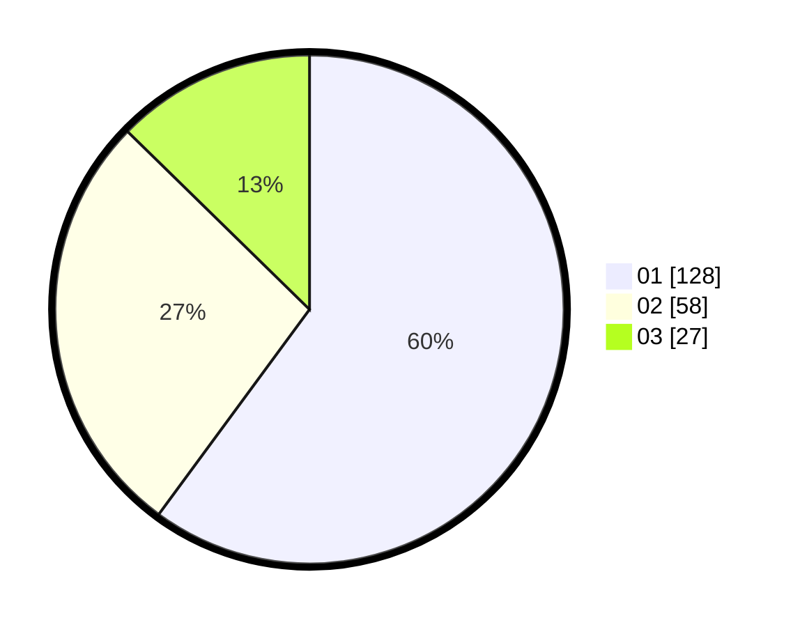

# Hasil

Hasil perolehan suara paslon dapat dilihat pada file paslon-01.txt, paslon-02.txt, dan paslon-03.txt.

Jika tidak ada, artinya data tersebut belum ada pada SIREKAP.

## Perolehan Suara

 * Paslon 01: **128**.
 * Paslon 02: **58**.
 * Paslon 03: **27**.

## Foto C Plano

https://sirekap-obj-formc.kpu.go.id/6b59/pemilu/ppwp/31/75/04/10/05/3175041005027-20240214-194946--6c887504-d135-41d5-91ad-46258a9e4221.jpg

https://sirekap-obj-formc.kpu.go.id/6b59/pemilu/ppwp/31/75/04/10/05/3175041005027-20240214-195008--4c4e7b41-1cf7-4c26-b2c6-78ef951ed112.jpg

https://sirekap-obj-formc.kpu.go.id/6b59/pemilu/ppwp/31/75/04/10/05/3175041005027-20240214-194957--f38dfa9d-084f-44e2-9668-6dd584934bb1.jpg

## DATA PEMILIH TETAP

Jumlah pemilih dalam DPT: **269**.
 * L: **128**.
 * P: **141**.

## DATA PENGGUNA HAK PILIH

Jumlah pengguna hak pilih dalam DPT: **214**.
 * L: **95**.
 * P: **119**.

Jumlah pengguna hak pilih dalam DPTb: **0**.
 * L: **0**.
 * P: **0**.

Jumlah pengguna hak pilih dalam DPK: **3**.
 * L: **2**.
 * P: **1**.

Jumlah pengguna hak pilih: **217**.
 * L: **97**.
 * P: **120**.

## JUMLAH SUARA SAH DAN TIDAK SAH

JUMLAH SELURUH SUARA SAH: **213**.

JUMLAH SUARA TIDAK SAH: **4**.

JUMLAH SELURUH SUARA SAH DAN SUARA TIDAK SAH: **217**.
