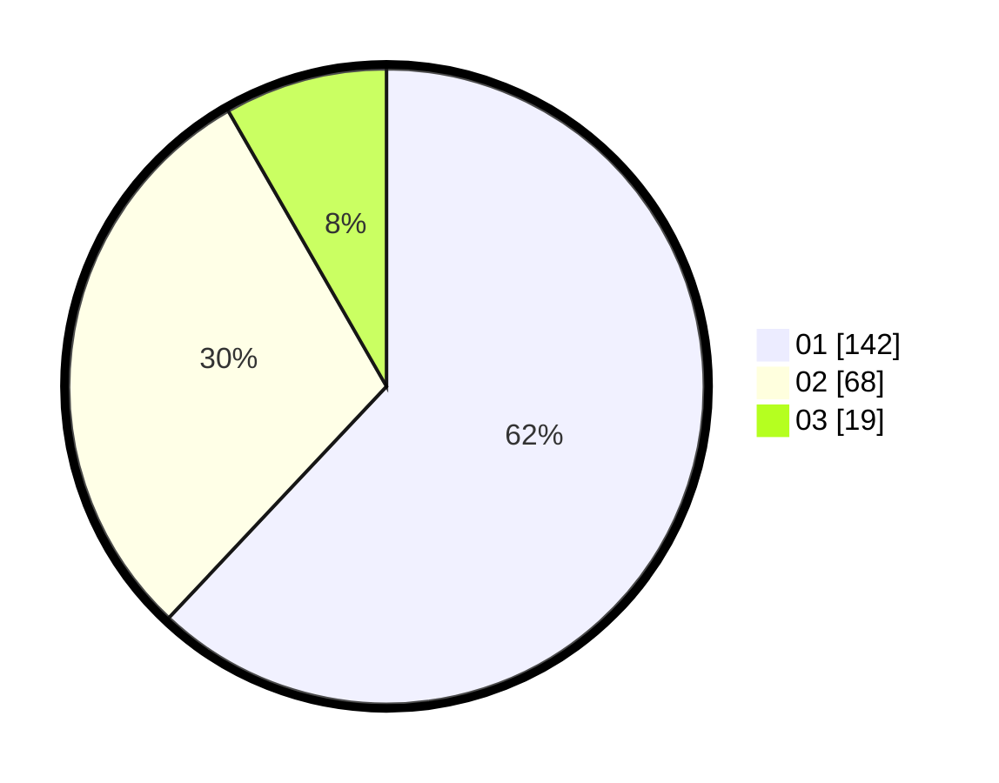

# Hasil

Hasil perolehan suara paslon dapat dilihat pada file paslon-01.txt, paslon-02.txt, dan paslon-03.txt.

Jika tidak ada, artinya data tersebut belum ada pada SIREKAP.

## Perolehan Suara

 * Paslon 01: **142**.
 * Paslon 02: **68**.
 * Paslon 03: **19**.

## Foto C Plano

https://sirekap-obj-formc.kpu.go.id/fdf0/pemilu/ppwp/31/75/04/10/05/3175041005028-20240214-230057--113edd91-c4c9-4b55-9e68-695c0e83de8c.jpg

https://sirekap-obj-formc.kpu.go.id/fdf0/pemilu/ppwp/31/75/04/10/05/3175041005028-20240214-230305--9462e243-eb39-439a-a2bc-24b620469db0.jpg

https://sirekap-obj-formc.kpu.go.id/fdf0/pemilu/ppwp/31/75/04/10/05/3175041005028-20240214-230354--b5984dc3-a2e0-46de-a5c8-c8251b3495dc.jpg

## DATA PEMILIH TETAP

Jumlah pemilih dalam DPT: **225**.
 * L: **103**.
 * P: **122**.

## DATA PENGGUNA HAK PILIH

Jumlah pengguna hak pilih dalam DPT: **225**.
 * L: **103**.
 * P: **122**.

Jumlah pengguna hak pilih dalam DPTb: **3**.
 * L: **0**.
 * P: **3**.

Jumlah pengguna hak pilih dalam DPK: **1**.
 * L: **1**.
 * P: **0**.

Jumlah pengguna hak pilih: **229**.
 * L: **104**.
 * P: **125**.

## JUMLAH SUARA SAH DAN TIDAK SAH

JUMLAH SELURUH SUARA SAH: **229**.

JUMLAH SUARA TIDAK SAH: **1**.

JUMLAH SELURUH SUARA SAH DAN SUARA TIDAK SAH: **230**.
