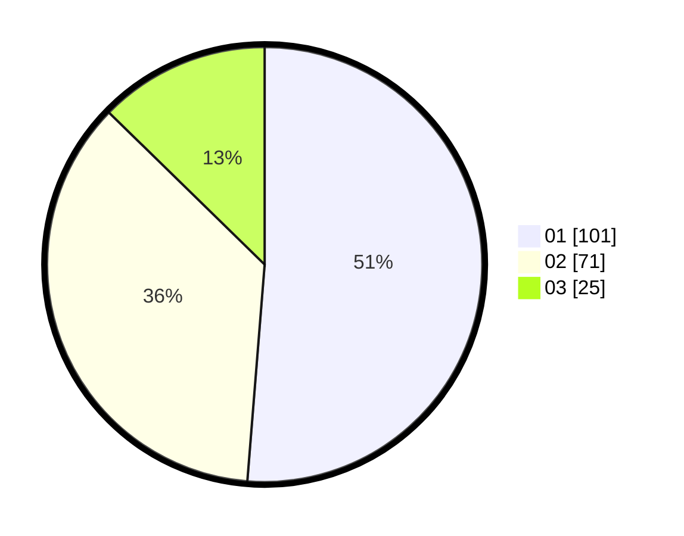

# Hasil

Hasil perolehan suara paslon dapat dilihat pada file paslon-01.txt, paslon-02.txt, dan paslon-03.txt.

Jika tidak ada, artinya data tersebut belum ada pada SIREKAP.

## Perolehan Suara

 * Paslon 01: **101**.
 * Paslon 02: **71**.
 * Paslon 03: **25**.

## Foto C Plano

https://sirekap-obj-formc.kpu.go.id/4dba/pemilu/ppwp/31/75/04/10/05/3175041005029-20240214-200921--e6964356-fb9c-45ab-8fa4-66ead8d968a3.jpg

https://sirekap-obj-formc.kpu.go.id/4dba/pemilu/ppwp/31/75/04/10/05/3175041005029-20240214-201009--aad959d6-7b36-47c9-9b99-ecc727318398.jpg

https://sirekap-obj-formc.kpu.go.id/4dba/pemilu/ppwp/31/75/04/10/05/3175041005029-20240214-203142--9ea6df7a-7433-4182-9bb3-5eadb44e1e68.jpg
