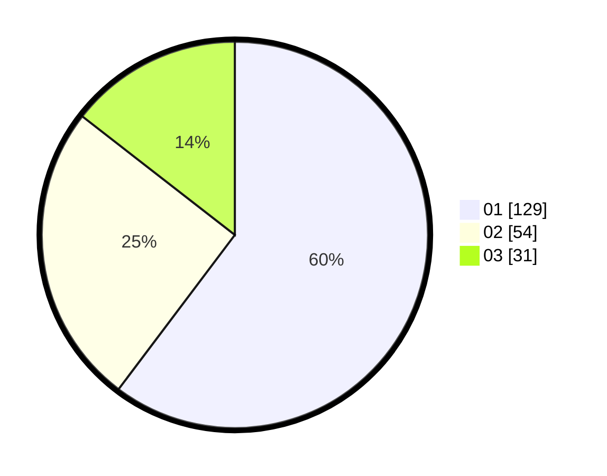

# Hasil

Hasil perolehan suara paslon dapat dilihat pada file paslon-01.txt, paslon-02.txt, dan paslon-03.txt.

Jika tidak ada, artinya data tersebut belum ada pada SIREKAP.

## Perolehan Suara

 * Paslon 01: **129**.
 * Paslon 02: **54**.
 * Paslon 03: **31**.

## Foto C Plano

https://sirekap-obj-formc.kpu.go.id/85d9/pemilu/ppwp/31/75/04/10/05/3175041005033-20240215-021725--865d848d-57e2-452e-aaa5-d7b7e96b1485.jpg

https://sirekap-obj-formc.kpu.go.id/85d9/pemilu/ppwp/31/75/04/10/05/3175041005033-20240215-021805--e8c6139b-3e7a-47c8-874b-cefbdf631325.jpg

https://sirekap-obj-formc.kpu.go.id/85d9/pemilu/ppwp/31/75/04/10/05/3175041005033-20240215-021842--30fef4e4-1d60-4da6-8a95-5ddb30ee31a4.jpg
