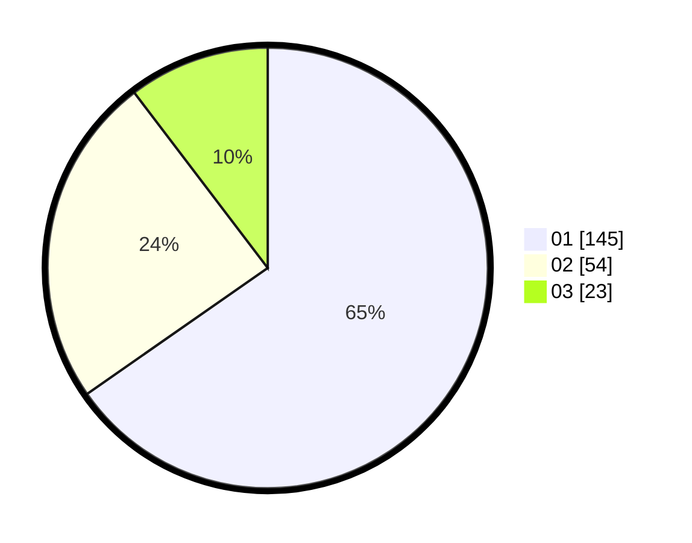

# Hasil

Hasil perolehan suara paslon dapat dilihat pada file paslon-01.txt, paslon-02.txt, dan paslon-03.txt.

Jika tidak ada, artinya data tersebut belum ada pada SIREKAP.

## Perolehan Suara

 * Paslon 01: **145**.
 * Paslon 02: **54**.
 * Paslon 03: **23**.

## Foto C Plano

https://sirekap-obj-formc.kpu.go.id/025b/pemilu/ppwp/31/75/04/10/05/3175041005034-20240215-235037--268c1ea2-da38-4201-956f-8fe73afb8e0b.jpg

https://sirekap-obj-formc.kpu.go.id/025b/pemilu/ppwp/31/75/04/10/05/3175041005034-20240215-235336--5690ecf2-3c40-4336-bc47-13dd15005e62.jpg

https://sirekap-obj-formc.kpu.go.id/025b/pemilu/ppwp/31/75/04/10/05/3175041005034-20240216-000036--49715541-64c4-40c9-b3bb-b03f0c13051e.jpg

## DATA PEMILIH TETAP

Jumlah pemilih dalam DPT: **272**.
 * L: **136**.
 * P: **136**.

## DATA PENGGUNA HAK PILIH

Jumlah pengguna hak pilih dalam DPT: **226**.
 * L: **109**.
 * P: **117**.

Jumlah pengguna hak pilih dalam DPTb: **0**.
 * L: **0**.
 * P: **0**.

Jumlah pengguna hak pilih dalam DPK: **0**.
 * L: **0**.
 * P: **0**.

Jumlah pengguna hak pilih: **226**.
 * L: **109**.
 * P: **117**.

## JUMLAH SUARA SAH DAN TIDAK SAH

JUMLAH SELURUH SUARA SAH: **222**.

JUMLAH SUARA TIDAK SAH: **4**.

JUMLAH SELURUH SUARA SAH DAN SUARA TIDAK SAH: **226**.
