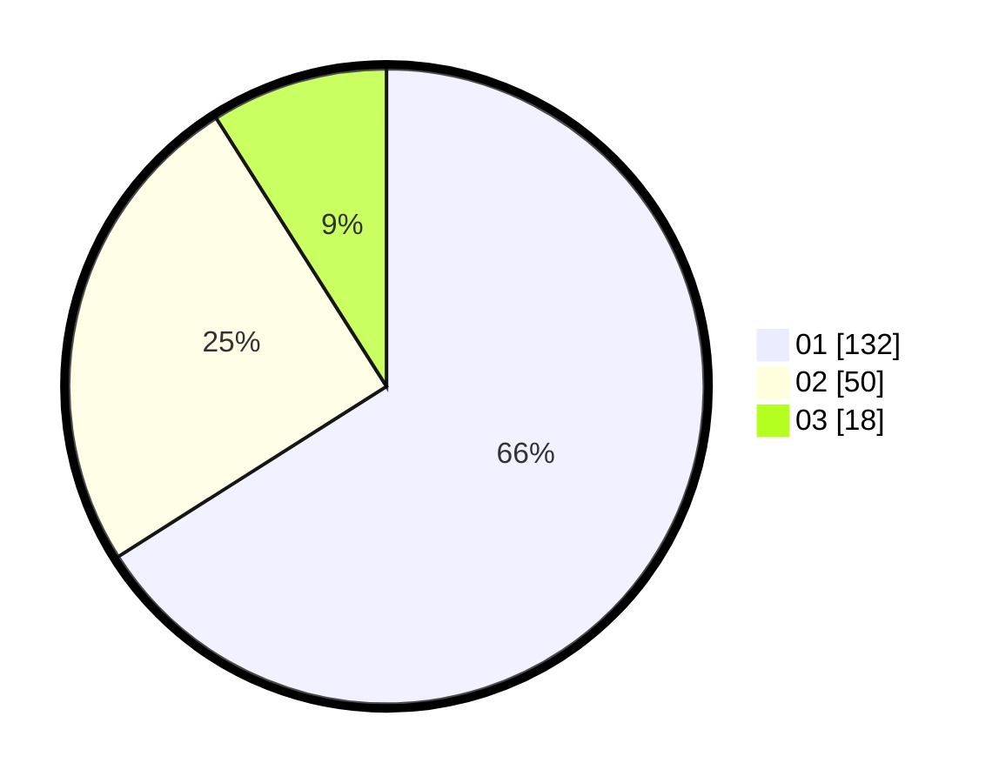

# Hasil

Hasil perolehan suara paslon dapat dilihat pada file paslon-01.txt, paslon-02.txt, dan paslon-03.txt.

Jika tidak ada, artinya data tersebut belum ada pada SIREKAP.

## Perolehan Suara

 * Paslon 01: **132**.
 * Paslon 02: **50**.
 * Paslon 03: **18**.

## Foto C Plano

https://sirekap-obj-formc.kpu.go.id/e513/pemilu/ppwp/31/75/04/10/05/3175041005035-20240215-150310--2350087d-4348-4c4d-9328-1f438ac9ec19.jpg

https://sirekap-obj-formc.kpu.go.id/e513/pemilu/ppwp/31/75/04/10/05/3175041005035-20240216-061234--ffd3ccf3-b9c5-4730-9a75-9624499f6afb.jpg

https://sirekap-obj-formc.kpu.go.id/e513/pemilu/ppwp/31/75/04/10/05/3175041005035-20240214-230255--971c138a-e643-432f-96c7-d08edb699f68.jpg

## DATA PEMILIH TETAP

Jumlah pemilih dalam DPT: **281**.
 * L: **141**.
 * P: **140**.

## DATA PENGGUNA HAK PILIH

Jumlah pengguna hak pilih dalam DPT: **206**.
 * L: **102**.
 * P: **104**.

Jumlah pengguna hak pilih dalam DPTb: **0**.
 * L: **0**.
 * P: **0**.

Jumlah pengguna hak pilih dalam DPK: **5**.
 * L: **2**.
 * P: **3**.

Jumlah pengguna hak pilih: **211**.
 * L: **104**.
 * P: **107**.

## JUMLAH SUARA SAH DAN TIDAK SAH

JUMLAH SELURUH SUARA SAH: **210**.

JUMLAH SUARA TIDAK SAH: **1**.

JUMLAH SELURUH SUARA SAH DAN SUARA TIDAK SAH: **211**.
