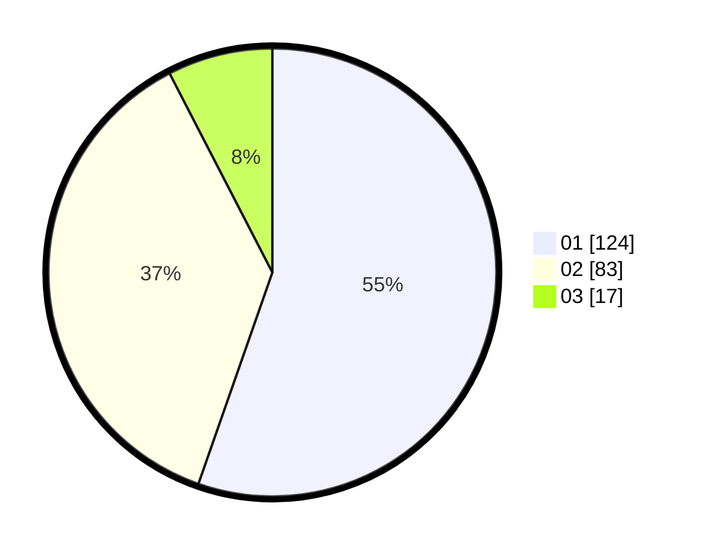

# Hasil

Hasil perolehan suara paslon dapat dilihat pada file paslon-01.txt, paslon-02.txt, dan paslon-03.txt.

Jika tidak ada, artinya data tersebut belum ada pada SIREKAP.

## Perolehan Suara

 * Paslon 01: **124**.
 * Paslon 02: **83**.
 * Paslon 03: **17**.

## Foto C Plano

https://sirekap-obj-formc.kpu.go.id/19c3/pemilu/ppwp/31/75/04/10/05/3175041005036-20240218-064753--a8dd702c-c266-42c1-bcc9-b8b505f3960d.jpg

https://sirekap-obj-formc.kpu.go.id/19c3/pemilu/ppwp/31/75/04/10/05/3175041005036-20240218-065744--e39ed611-1316-41d3-b8b4-60acae651b75.jpg

https://sirekap-obj-formc.kpu.go.id/19c3/pemilu/ppwp/31/75/04/10/05/3175041005036-20240218-065001--9ecc1a6a-3a8b-4d31-9db6-5cf11d4c3319.jpg

## DATA PEMILIH TETAP

Jumlah pemilih dalam DPT: **269**.
 * L: **123**.
 * P: **146**.

## DATA PENGGUNA HAK PILIH

Jumlah pengguna hak pilih dalam DPT: **225**.
 * L: **96**.
 * P: **129**.

Jumlah pengguna hak pilih dalam DPTb: **0**.
 * L: **0**.
 * P: **0**.

Jumlah pengguna hak pilih dalam DPK: **0**.
 * L: **0**.
 * P: **0**.

Jumlah pengguna hak pilih: **225**.
 * L: **96**.
 * P: **129**.

## JUMLAH SUARA SAH DAN TIDAK SAH

JUMLAH SELURUH SUARA SAH: **224**.

JUMLAH SUARA TIDAK SAH: **1**.

JUMLAH SELURUH SUARA SAH DAN SUARA TIDAK SAH: **225**.
