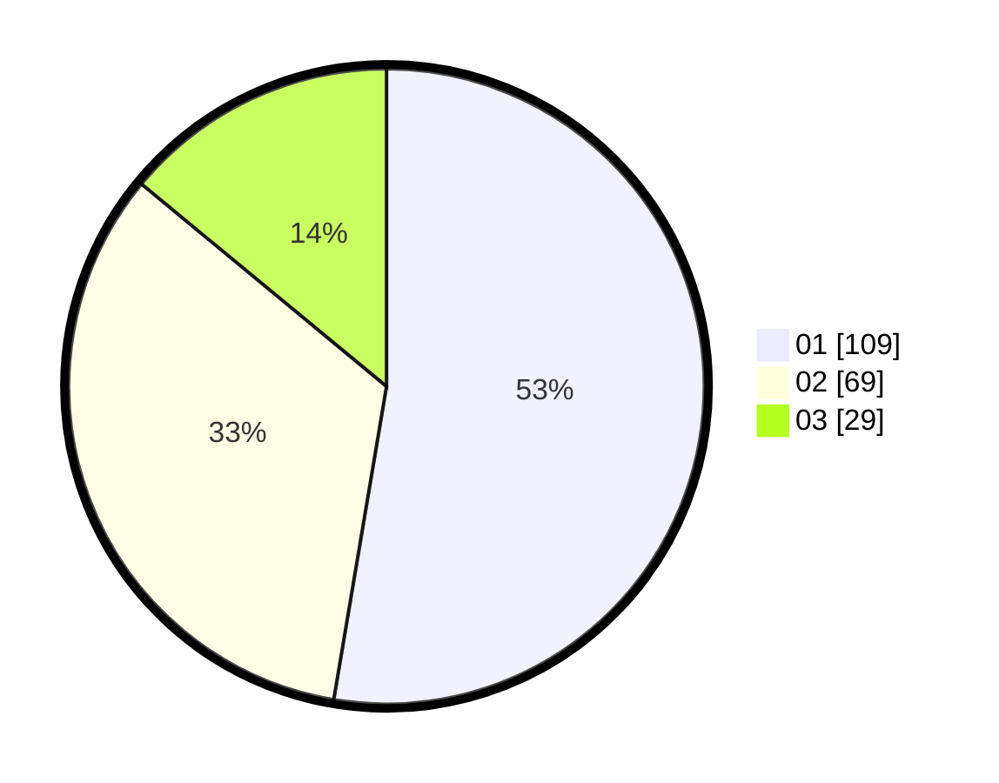

# Hasil

Hasil perolehan suara paslon dapat dilihat pada file paslon-01.txt, paslon-02.txt, dan paslon-03.txt.

Jika tidak ada, artinya data tersebut belum ada pada SIREKAP.

## Perolehan Suara

 * Paslon 01: **109**.
 * Paslon 02: **69**.
 * Paslon 03: **29**.

## Foto C Plano

https://sirekap-obj-formc.kpu.go.id/a4e4/pemilu/ppwp/31/75/04/10/05/3175041005038-20240214-205809--4279084a-854a-4368-b8e6-22d36b97147d.jpg

https://sirekap-obj-formc.kpu.go.id/a4e4/pemilu/ppwp/31/75/04/10/05/3175041005038-20240214-210009--8c13e4e8-d8ea-47a0-a77d-10138e1893f5.jpg

https://sirekap-obj-formc.kpu.go.id/a4e4/pemilu/ppwp/31/75/04/10/05/3175041005038-20240214-210245--710e8bb0-2fc7-4feb-841e-5c6298944474.jpg

## DATA PEMILIH TETAP

Jumlah pemilih dalam DPT: **285**.
 * L: **150**.
 * P: **135**.

## DATA PENGGUNA HAK PILIH

Jumlah pengguna hak pilih dalam DPT: **207**.
 * L: **101**.
 * P: **106**.

Jumlah pengguna hak pilih dalam DPTb: **1**.
 * L: **0**.
 * P: **1**.

Jumlah pengguna hak pilih dalam DPK: **0**.
 * L: **0**.
 * P: **0**.

Jumlah pengguna hak pilih: **208**.
 * L: **101**.
 * P: **107**.

## JUMLAH SUARA SAH DAN TIDAK SAH

JUMLAH SELURUH SUARA SAH: **207**.

JUMLAH SUARA TIDAK SAH: **1**.

JUMLAH SELURUH SUARA SAH DAN SUARA TIDAK SAH: **208**.
