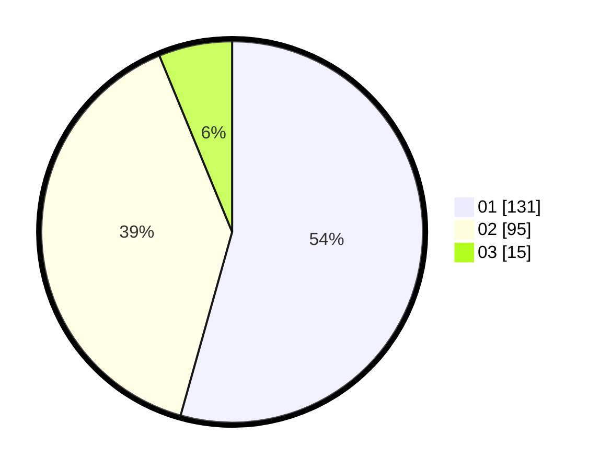

# Hasil

Hasil perolehan suara paslon dapat dilihat pada file paslon-01.txt, paslon-02.txt, dan paslon-03.txt.

Jika tidak ada, artinya data tersebut belum ada pada SIREKAP.

## Perolehan Suara

 * Paslon 01: **131**.
 * Paslon 02: **95**.
 * Paslon 03: **15**.

## Foto C Plano

https://sirekap-obj-formc.kpu.go.id/5a3a/pemilu/ppwp/31/75/04/10/05/3175041005049-20240215-023705--ea82cc3a-a5bd-4608-bb4c-eb4cc9fca10b.jpg

https://sirekap-obj-formc.kpu.go.id/5a3a/pemilu/ppwp/31/75/04/10/05/3175041005049-20240215-023829--c5d4eb3a-1cda-4395-877d-7cd75da0c2b0.jpg

https://sirekap-obj-formc.kpu.go.id/5a3a/pemilu/ppwp/31/75/04/10/05/3175041005049-20240215-024044--12a833b4-8315-4dc8-99e1-5996b148787d.jpg
