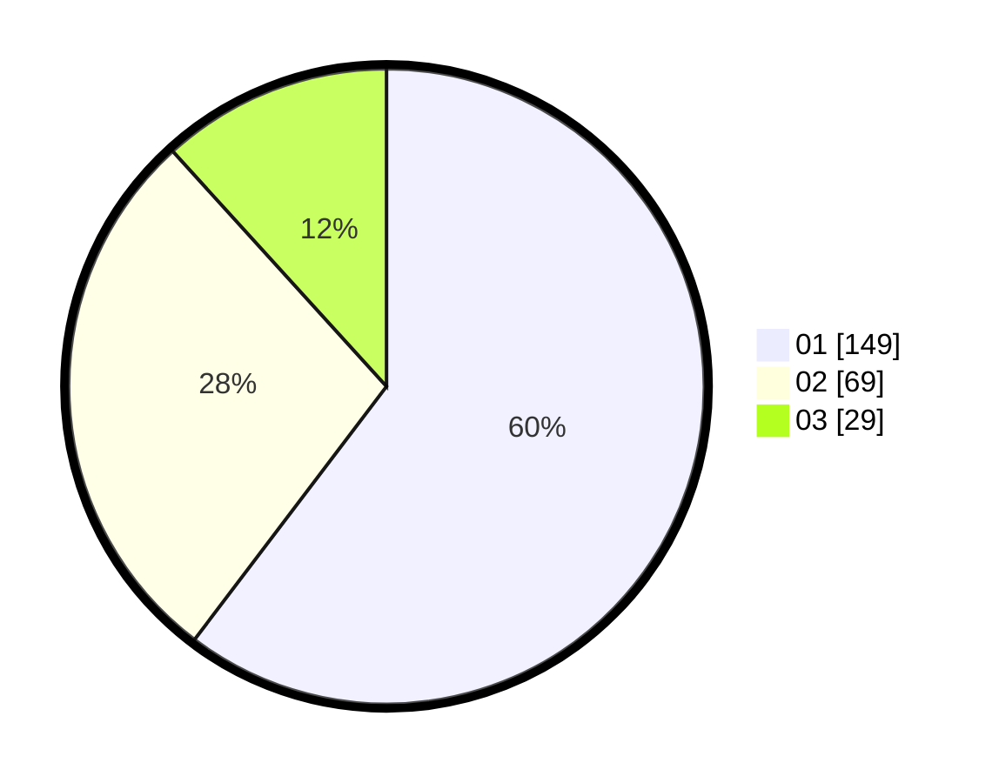

# Hasil

Hasil perolehan suara paslon dapat dilihat pada file paslon-01.txt, paslon-02.txt, dan paslon-03.txt.

Jika tidak ada, artinya data tersebut belum ada pada SIREKAP.

## Perolehan Suara

 * Paslon 01: **149**.
 * Paslon 02: **69**.
 * Paslon 03: **29**.

## Foto C Plano

https://sirekap-obj-formc.kpu.go.id/4bab/pemilu/ppwp/31/75/04/10/05/3175041005051-20240215-032253--978994ed-7861-4672-99b1-621b1182f24d.jpg

https://sirekap-obj-formc.kpu.go.id/4bab/pemilu/ppwp/31/75/04/10/05/3175041005051-20240215-032459--6a9f1593-fa1b-489c-9942-df9b44f55823.jpg

https://sirekap-obj-formc.kpu.go.id/4bab/pemilu/ppwp/31/75/04/10/05/3175041005051-20240215-032700--34ab292d-c952-484f-a205-6aa22eb52aed.jpg
