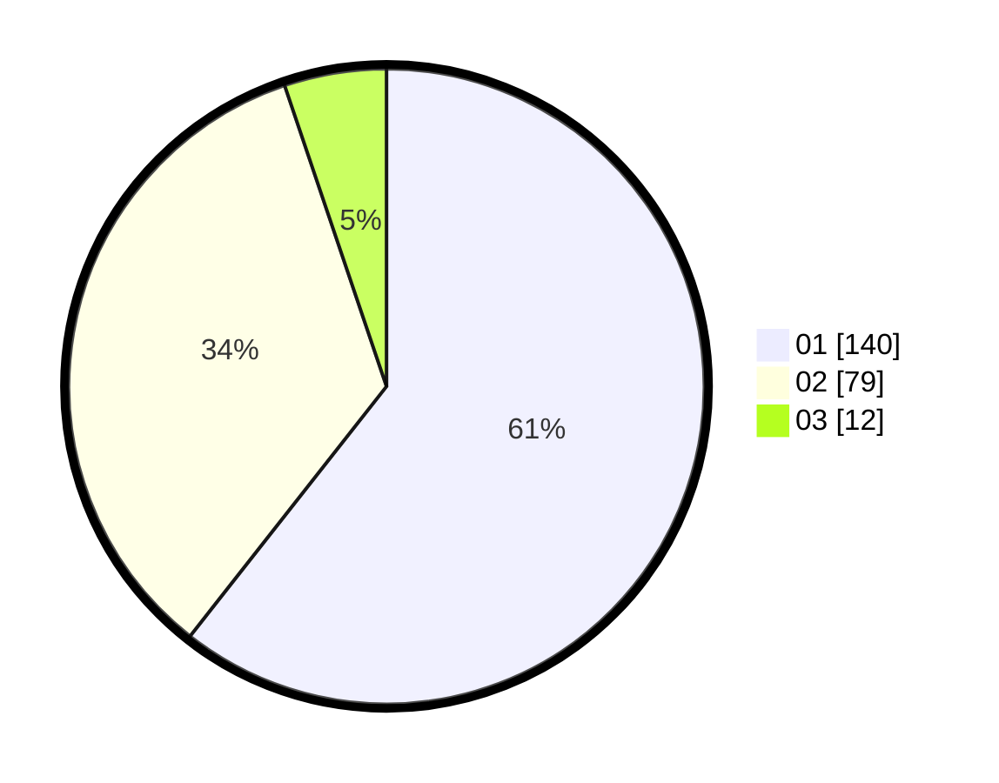

# Hasil

Hasil perolehan suara paslon dapat dilihat pada file paslon-01.txt, paslon-02.txt, dan paslon-03.txt.

Jika tidak ada, artinya data tersebut belum ada pada SIREKAP.

## Perolehan Suara

 * Paslon 01: **140**.
 * Paslon 02: **79**.
 * Paslon 03: **12**.

## Foto C Plano

https://sirekap-obj-formc.kpu.go.id/344a/pemilu/ppwp/31/75/04/10/05/3175041005053-20240214-200825--df26b684-ea16-41a8-9139-7ab5b3586c0e.jpg

https://sirekap-obj-formc.kpu.go.id/344a/pemilu/ppwp/31/75/04/10/05/3175041005053-20240214-201113--9a018bd8-61ee-446b-a86d-023d60b9db06.jpg

https://sirekap-obj-formc.kpu.go.id/344a/pemilu/ppwp/31/75/04/10/05/3175041005053-20240214-215157--8fb3ca1a-aa24-4f68-9f15-a99cd187da57.jpg
