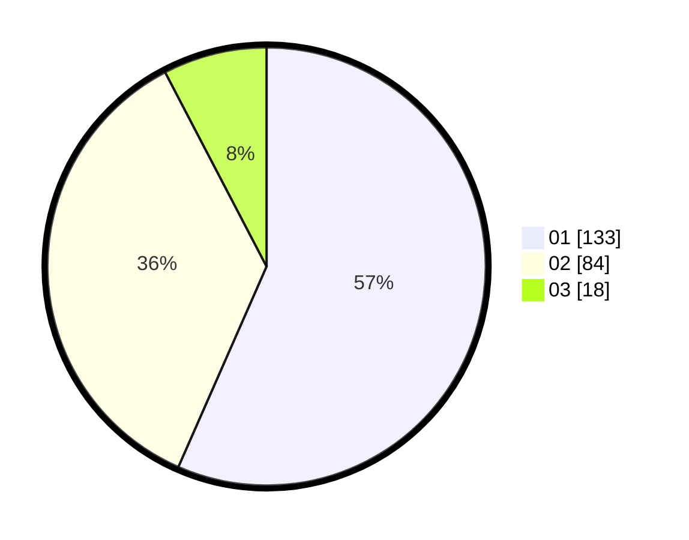

# Hasil

Hasil perolehan suara paslon dapat dilihat pada file paslon-01.txt, paslon-02.txt, dan paslon-03.txt.

Jika tidak ada, artinya data tersebut belum ada pada SIREKAP.

## Perolehan Suara

 * Paslon 01: **133**.
 * Paslon 02: **84**.
 * Paslon 03: **18**.

## Foto C Plano

https://sirekap-obj-formc.kpu.go.id/9fde/pemilu/ppwp/31/75/04/10/05/3175041005055-20240214-190949--c380652b-0807-461b-bc1a-bd3bb267a647.jpg

https://sirekap-obj-formc.kpu.go.id/9fde/pemilu/ppwp/31/75/04/10/05/3175041005055-20240214-201942--d51bb2bd-e987-4733-b007-2b18e9777274.jpg

https://sirekap-obj-formc.kpu.go.id/9fde/pemilu/ppwp/31/75/04/10/05/3175041005055-20240217-110741--1af9837c-8b0e-4ede-80a9-2067ff8f5f00.jpg

## DATA PEMILIH TETAP

Jumlah pemilih dalam DPT: **283**.
 * L: **131**.
 * P: **152**.

## DATA PENGGUNA HAK PILIH

Jumlah pengguna hak pilih dalam DPT: **230**.
 * L: **105**.
 * P: **125**.

Jumlah pengguna hak pilih dalam DPTb: **3**.
 * L: **2**.
 * P: **1**.

Jumlah pengguna hak pilih dalam DPK: **3**.
 * L: **1**.
 * P: **2**.

Jumlah pengguna hak pilih: **236**.
 * L: **108**.
 * P: **128**.

## JUMLAH SUARA SAH DAN TIDAK SAH

JUMLAH SELURUH SUARA SAH: **235**.

JUMLAH SUARA TIDAK SAH: **1**.

JUMLAH SELURUH SUARA SAH DAN SUARA TIDAK SAH: **236**.
