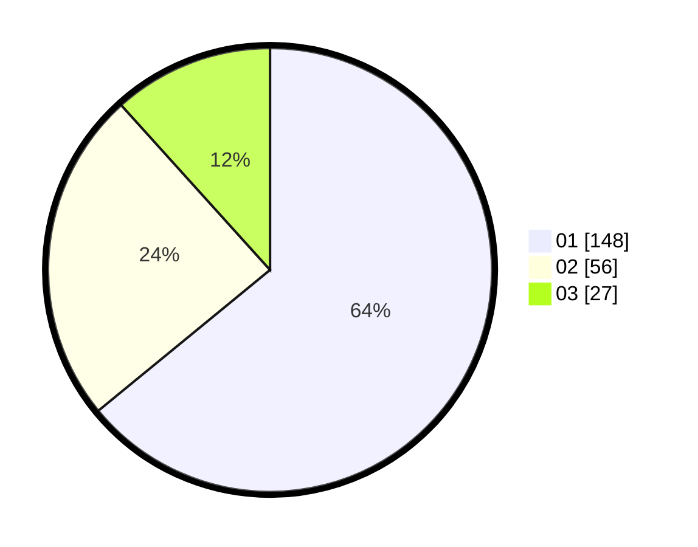

# Hasil

Hasil perolehan suara paslon dapat dilihat pada file paslon-01.txt, paslon-02.txt, dan paslon-03.txt.

Jika tidak ada, artinya data tersebut belum ada pada SIREKAP.

## Perolehan Suara

 * Paslon 01: **148**.
 * Paslon 02: **56**.
 * Paslon 03: **27**.

## Foto C Plano

https://sirekap-obj-formc.kpu.go.id/636c/pemilu/ppwp/31/75/04/10/05/3175041005062-20240217-120918--1ff5351a-cb28-440c-8cfd-f792b43e808e.jpg

https://sirekap-obj-formc.kpu.go.id/636c/pemilu/ppwp/31/75/04/10/05/3175041005062-20240217-131205--b0ddae64-58e3-43c8-a939-609b35d56327.jpg

https://sirekap-obj-formc.kpu.go.id/636c/pemilu/ppwp/31/75/04/10/05/3175041005062-20240217-132524--9eafbdfa-6c0b-46f7-87da-e9601717f5c4.jpg

## DATA PEMILIH TETAP

Jumlah pemilih dalam DPT: **297**.
 * L: **144**.
 * P: **153**.

## DATA PENGGUNA HAK PILIH

Jumlah pengguna hak pilih dalam DPT: **236**.
 * L: **114**.
 * P: **122**.

Jumlah pengguna hak pilih dalam DPTb: **0**.
 * L: **0**.
 * P: **0**.

Jumlah pengguna hak pilih dalam DPK: **3**.
 * L: **2**.
 * P: **1**.

Jumlah pengguna hak pilih: **239**.
 * L: **116**.
 * P: **123**.

## JUMLAH SUARA SAH DAN TIDAK SAH

JUMLAH SELURUH SUARA SAH: **231**.

JUMLAH SUARA TIDAK SAH: **8**.

JUMLAH SELURUH SUARA SAH DAN SUARA TIDAK SAH: **239**.
