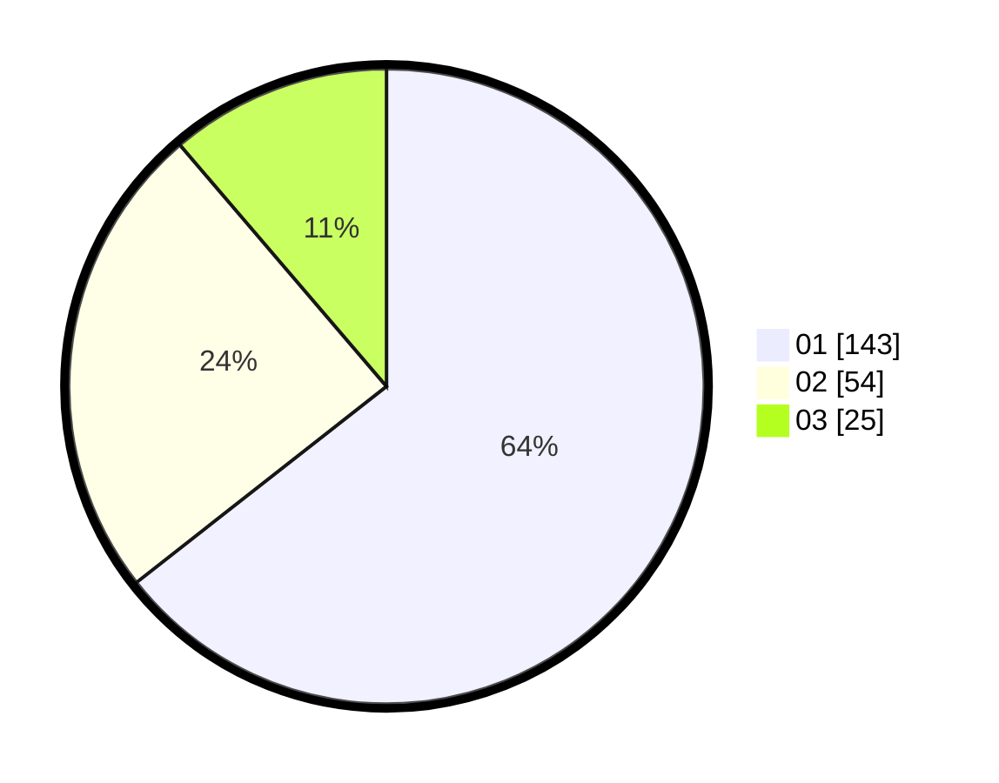

# Hasil

Hasil perolehan suara paslon dapat dilihat pada file paslon-01.txt, paslon-02.txt, dan paslon-03.txt.

Jika tidak ada, artinya data tersebut belum ada pada SIREKAP.

## Perolehan Suara

 * Paslon 01: **143**.
 * Paslon 02: **54**.
 * Paslon 03: **25**.

## Foto C Plano

https://sirekap-obj-formc.kpu.go.id/89d2/pemilu/ppwp/31/75/04/10/05/3175041005066-20240216-192129--3241b6e6-fc73-48af-90ed-aa0b700544b0.jpg

https://sirekap-obj-formc.kpu.go.id/89d2/pemilu/ppwp/31/75/04/10/05/3175041005066-20240216-192503--c8532521-38e5-46fc-91b1-c59c9e8d267a.jpg

https://sirekap-obj-formc.kpu.go.id/89d2/pemilu/ppwp/31/75/04/10/05/3175041005066-20240216-192639--6c395c63-7c62-4f6b-a434-662fa21cdd6f.jpg

## DATA PEMILIH TETAP

Jumlah pemilih dalam DPT: **296**.
 * L: **138**.
 * P: **178**.

## DATA PENGGUNA HAK PILIH

Jumlah pengguna hak pilih dalam DPT: **227**.
 * L: **701**.
 * P: **126**.

Jumlah pengguna hak pilih dalam DPTb: **0**.
 * L: **0**.
 * P: **0**.

Jumlah pengguna hak pilih dalam DPK: **0**.
 * L: **0**.
 * P: **0**.

Jumlah pengguna hak pilih: **327**.
 * L: **191**.
 * P: **136**.

## JUMLAH SUARA SAH DAN TIDAK SAH

JUMLAH SELURUH SUARA SAH: **222**.

JUMLAH SUARA TIDAK SAH: **5**.

JUMLAH SELURUH SUARA SAH DAN SUARA TIDAK SAH: **227**.
