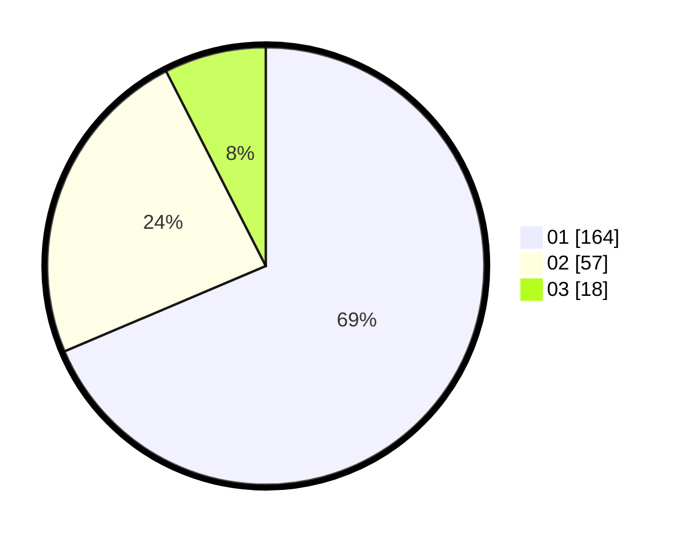

# Hasil

Hasil perolehan suara paslon dapat dilihat pada file paslon-01.txt, paslon-02.txt, dan paslon-03.txt.

Jika tidak ada, artinya data tersebut belum ada pada SIREKAP.

## Perolehan Suara

 * Paslon 01: **164**.
 * Paslon 02: **57**.
 * Paslon 03: **18**.

## Foto C Plano

https://sirekap-obj-formc.kpu.go.id/d520/pemilu/ppwp/31/75/04/10/05/3175041005068-20240218-223305--b568f161-45c4-4875-a2eb-b2cdf05ee25e.jpg

https://sirekap-obj-formc.kpu.go.id/d520/pemilu/ppwp/31/75/04/10/05/3175041005068-20240214-155846--ed20627b-9899-49fe-8413-53c769e6c721.jpg

https://sirekap-obj-formc.kpu.go.id/d520/pemilu/ppwp/31/75/04/10/05/3175041005068-20240218-223305--667668ad-2f9f-48da-9a7a-f9afdb1f0de5.jpg

## DATA PEMILIH TETAP

Jumlah pemilih dalam DPT: **269**.
 * L: **128**.
 * P: **141**.

## DATA PENGGUNA HAK PILIH

Jumlah pengguna hak pilih dalam DPT: **222**.
 * L: **100**.
 * P: **122**.

Jumlah pengguna hak pilih dalam DPTb: **17**.
 * L: **6**.
 * P: **11**.

Jumlah pengguna hak pilih dalam DPK: **0**.
 * L: **0**.
 * P: **0**.

Jumlah pengguna hak pilih: **239**.
 * L: **106**.
 * P: **133**.

## JUMLAH SUARA SAH DAN TIDAK SAH

JUMLAH SELURUH SUARA SAH: **239**.

JUMLAH SUARA TIDAK SAH: **0**.

JUMLAH SELURUH SUARA SAH DAN SUARA TIDAK SAH: **239**.
