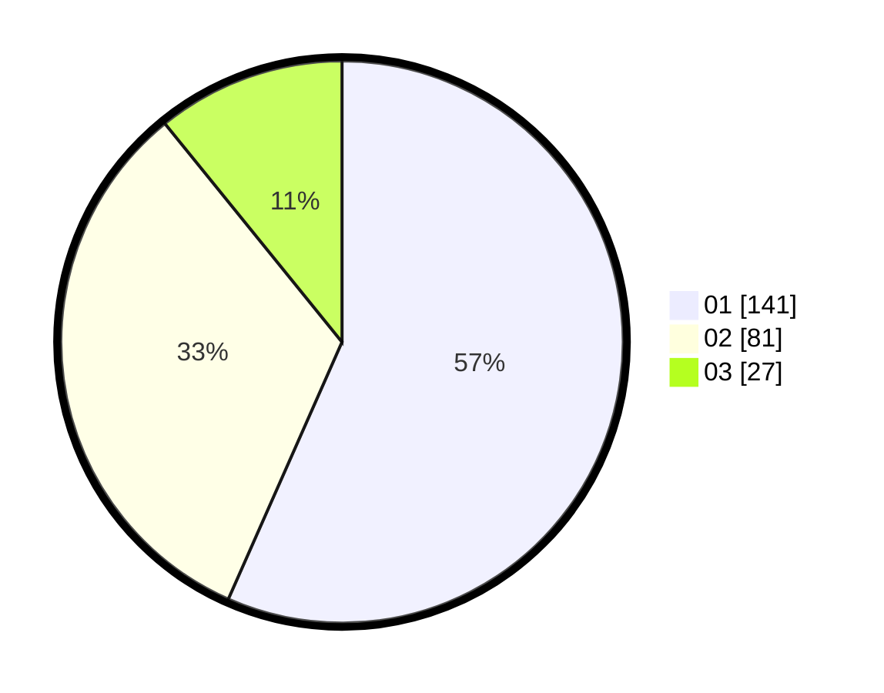

# Hasil

Hasil perolehan suara paslon dapat dilihat pada file paslon-01.txt, paslon-02.txt, dan paslon-03.txt.

Jika tidak ada, artinya data tersebut belum ada pada SIREKAP.

## Perolehan Suara

 * Paslon 01: **141**.
 * Paslon 02: **81**.
 * Paslon 03: **27**.

## Foto C Plano

https://sirekap-obj-formc.kpu.go.id/737a/pemilu/ppwp/31/75/04/10/05/3175041005075-20240215-084307--7c9043da-dcde-4d9e-8a9f-1d096ce659f6.jpg

https://sirekap-obj-formc.kpu.go.id/737a/pemilu/ppwp/31/75/04/10/05/3175041005075-20240215-013113--9e44d639-5b8f-4698-ba04-4398b941d50a.jpg
