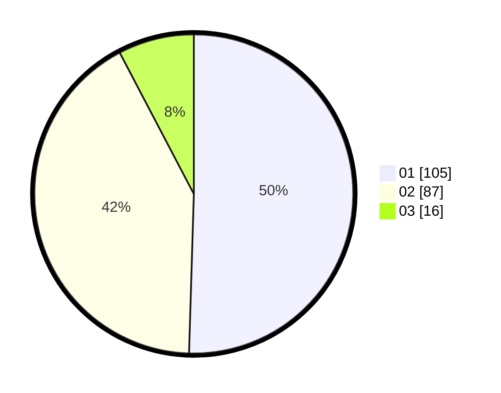

# Hasil

Hasil perolehan suara paslon dapat dilihat pada file paslon-01.txt, paslon-02.txt, dan paslon-03.txt.

Jika tidak ada, artinya data tersebut belum ada pada SIREKAP.

## Perolehan Suara

 * Paslon 01: **105**.
 * Paslon 02: **87**.
 * Paslon 03: **16**.

## Foto C Plano

https://sirekap-obj-formc.kpu.go.id/8de8/pemilu/ppwp/31/75/04/10/05/3175041005079-20240214-222341--5b7f762f-40b8-4ba1-aeba-e11581b3c5c4.jpg

https://sirekap-obj-formc.kpu.go.id/8de8/pemilu/ppwp/31/75/04/10/05/3175041005079-20240214-222501--1d7f2d34-4805-4242-9803-af75be4aa43a.jpg

https://sirekap-obj-formc.kpu.go.id/8de8/pemilu/ppwp/31/75/04/10/05/3175041005079-20240214-222630--400b42cd-2297-4436-ad11-81b0eed6bec1.jpg

## DATA PEMILIH TETAP

Jumlah pemilih dalam DPT: **274**.
 * L: **148**.
 * P: **126**.

## DATA PENGGUNA HAK PILIH

Jumlah pengguna hak pilih dalam DPT: **209**.
 * L: **113**.
 * P: **96**.

Jumlah pengguna hak pilih dalam DPTb: **1**.
 * L: **1**.
 * P: **0**.

Jumlah pengguna hak pilih dalam DPK: **1**.
 * L: **0**.
 * P: **1**.

Jumlah pengguna hak pilih: **211**.
 * L: **114**.
 * P: **97**.

## JUMLAH SUARA SAH DAN TIDAK SAH

JUMLAH SELURUH SUARA SAH: **208**.

JUMLAH SUARA TIDAK SAH: **3**.

JUMLAH SELURUH SUARA SAH DAN SUARA TIDAK SAH: **211**.
