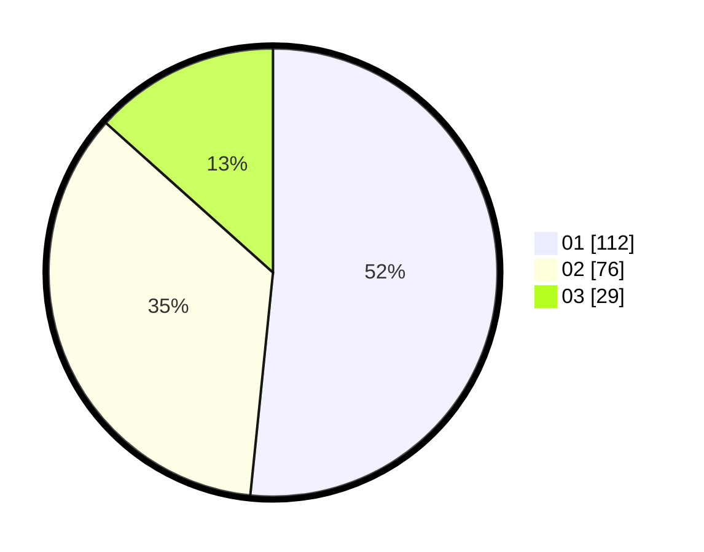

# Hasil

Hasil perolehan suara paslon dapat dilihat pada file paslon-01.txt, paslon-02.txt, dan paslon-03.txt.

Jika tidak ada, artinya data tersebut belum ada pada SIREKAP.

## Perolehan Suara

 * Paslon 01: **112**.
 * Paslon 02: **76**.
 * Paslon 03: **29**.

## Foto C Plano

https://sirekap-obj-formc.kpu.go.id/532d/pemilu/ppwp/31/75/04/10/05/3175041005080-20240216-150505--ab000aa9-100f-4a63-83b9-884e87adcc90.jpg

https://sirekap-obj-formc.kpu.go.id/532d/pemilu/ppwp/31/75/04/10/05/3175041005080-20240216-150507--33c48838-32e3-47f2-b362-d4a24f1dc45e.jpg

https://sirekap-obj-formc.kpu.go.id/532d/pemilu/ppwp/31/75/04/10/05/3175041005080-20240216-150506--7f16db47-4840-452b-8c73-1d54060de895.jpg

## DATA PEMILIH TETAP

Jumlah pemilih dalam DPT: **287**.
 * L: **137**.
 * P: **150**.

## DATA PENGGUNA HAK PILIH

Jumlah pengguna hak pilih dalam DPT: **216**.
 * L: **98**.
 * P: **118**.

Jumlah pengguna hak pilih dalam DPTb: **2**.
 * L: **1**.
 * P: **1**.

Jumlah pengguna hak pilih dalam DPK: **2**.
 * L: **1**.
 * P: **1**.

Jumlah pengguna hak pilih: **220**.
 * L: **100**.
 * P: **120**.

## JUMLAH SUARA SAH DAN TIDAK SAH

JUMLAH SELURUH SUARA SAH: **217**.

JUMLAH SUARA TIDAK SAH: **3**.

JUMLAH SELURUH SUARA SAH DAN SUARA TIDAK SAH: **220**.
