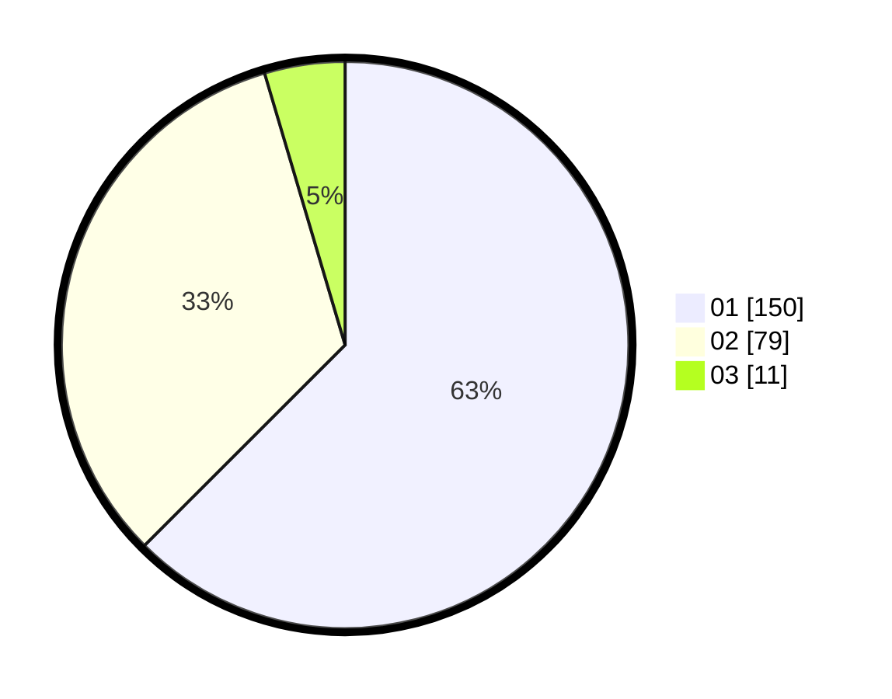

# Hasil

Hasil perolehan suara paslon dapat dilihat pada file paslon-01.txt, paslon-02.txt, dan paslon-03.txt.

Jika tidak ada, artinya data tersebut belum ada pada SIREKAP.

## Perolehan Suara

 * Paslon 01: **150**.
 * Paslon 02: **79**.
 * Paslon 03: **11**.

## Foto C Plano

https://sirekap-obj-formc.kpu.go.id/b111/pemilu/ppwp/31/75/04/10/05/3175041005083-20240215-003306--5247ada2-4836-462a-8db4-278c53e9094a.jpg

https://sirekap-obj-formc.kpu.go.id/b111/pemilu/ppwp/31/75/04/10/05/3175041005083-20240215-003418--3b52df14-9b02-4373-ad03-ff02595cc810.jpg

https://sirekap-obj-formc.kpu.go.id/b111/pemilu/ppwp/31/75/04/10/05/3175041005083-20240215-003516--111c82e3-b467-4ea0-a651-015d0d011d1a.jpg

## DATA PEMILIH TETAP

Jumlah pemilih dalam DPT: **282**.
 * L: **152**.
 * P: **130**.

## DATA PENGGUNA HAK PILIH

Jumlah pengguna hak pilih dalam DPT: **241**.
 * L: **123**.
 * P: **118**.

Jumlah pengguna hak pilih dalam DPTb: **0**.
 * L: **0**.
 * P: **0**.

Jumlah pengguna hak pilih dalam DPK: **0**.
 * L: **0**.
 * P: **0**.

Jumlah pengguna hak pilih: **241**.
 * L: **123**.
 * P: **118**.

## JUMLAH SUARA SAH DAN TIDAK SAH

JUMLAH SELURUH SUARA SAH: **240**.

JUMLAH SUARA TIDAK SAH: **1**.

JUMLAH SELURUH SUARA SAH DAN SUARA TIDAK SAH: **241**.
