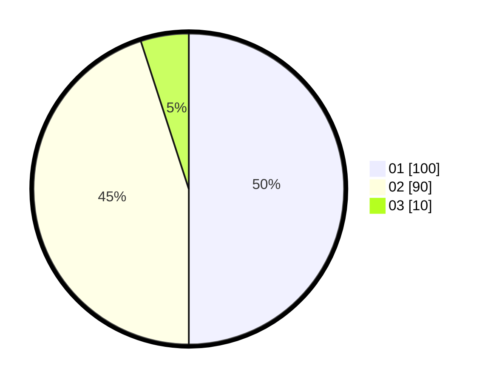

# Hasil

Hasil perolehan suara paslon dapat dilihat pada file paslon-01.txt, paslon-02.txt, dan paslon-03.txt.

Jika tidak ada, artinya data tersebut belum ada pada SIREKAP.

## Perolehan Suara

 * Paslon 01: **100**.
 * Paslon 02: **90**.
 * Paslon 03: **10**.

## Foto C Plano

https://sirekap-obj-formc.kpu.go.id/8965/pemilu/ppwp/31/75/04/10/05/3175041005088-20240214-155444--73537534-90e6-4903-8809-2b6ebe14d73b.jpg

https://sirekap-obj-formc.kpu.go.id/8965/pemilu/ppwp/31/75/04/10/05/3175041005088-20240214-155618--3ac5f701-f8f3-4920-ad5a-6adaa5558df8.jpg

https://sirekap-obj-formc.kpu.go.id/8965/pemilu/ppwp/31/75/04/10/05/3175041005088-20240214-160118--91e4ac6a-92bb-4712-bee7-361850f663ea.jpg

## DATA PEMILIH TETAP

Jumlah pemilih dalam DPT: **277**.
 * L: **139**.
 * P: **138**.

## DATA PENGGUNA HAK PILIH

Jumlah pengguna hak pilih dalam DPT: **200**.
 * L: **92**.
 * P: **108**.

Jumlah pengguna hak pilih dalam DPTb: **0**.
 * L: **0**.
 * P: **0**.

Jumlah pengguna hak pilih dalam DPK: **0**.
 * L: **0**.
 * P: **0**.

Jumlah pengguna hak pilih: **200**.
 * L: **92**.
 * P: **108**.

## JUMLAH SUARA SAH DAN TIDAK SAH

JUMLAH SELURUH SUARA SAH: **200**.

JUMLAH SUARA TIDAK SAH: **0**.

JUMLAH SELURUH SUARA SAH DAN SUARA TIDAK SAH: **200**.
