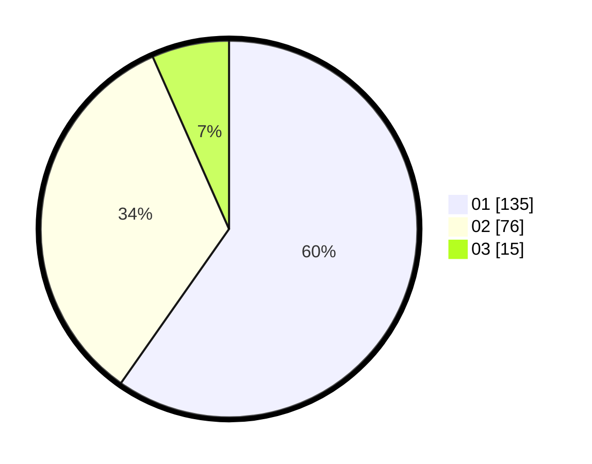

# Hasil

Hasil perolehan suara paslon dapat dilihat pada file paslon-01.txt, paslon-02.txt, dan paslon-03.txt.

Jika tidak ada, artinya data tersebut belum ada pada SIREKAP.

## Perolehan Suara

 * Paslon 01: **135**.
 * Paslon 02: **76**.
 * Paslon 03: **15**.

## Foto C Plano

https://sirekap-obj-formc.kpu.go.id/40ca/pemilu/ppwp/31/75/04/10/05/3175041005090-20240218-204357--27414cbe-ac89-4526-b0e4-1f63637fb6eb.jpg

https://sirekap-obj-formc.kpu.go.id/40ca/pemilu/ppwp/31/75/04/10/05/3175041005090-20240219-001939--f5d89524-d1c1-4e06-b760-0f77cdede9fd.jpg

https://sirekap-obj-formc.kpu.go.id/40ca/pemilu/ppwp/31/75/04/10/05/3175041005090-20240215-021841--1a9339f3-c92c-44f2-ba80-0c9237f487eb.jpg

## DATA PEMILIH TETAP

Jumlah pemilih dalam DPT: **280**.
 * L: **150**.
 * P: **130**.

## DATA PENGGUNA HAK PILIH

Jumlah pengguna hak pilih dalam DPT: **224**.
 * L: **116**.
 * P: **108**.

Jumlah pengguna hak pilih dalam DPTb: **1**.
 * L: **1**.
 * P: **0**.

Jumlah pengguna hak pilih dalam DPK: **3**.
 * L: **2**.
 * P: **1**.

Jumlah pengguna hak pilih: **228**.
 * L: **119**.
 * P: **109**.

## JUMLAH SUARA SAH DAN TIDAK SAH

JUMLAH SELURUH SUARA SAH: **226**.

JUMLAH SUARA TIDAK SAH: **2**.

JUMLAH SELURUH SUARA SAH DAN SUARA TIDAK SAH: **228**.
