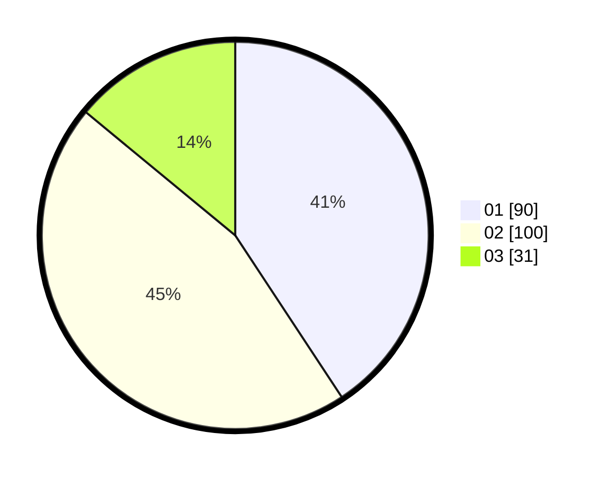

# Hasil

Hasil perolehan suara paslon dapat dilihat pada file paslon-01.txt, paslon-02.txt, dan paslon-03.txt.

Jika tidak ada, artinya data tersebut belum ada pada SIREKAP.

## Perolehan Suara

 * Paslon 01: **90**.
 * Paslon 02: **100**.
 * Paslon 03: **31**.

## Foto C Plano

https://sirekap-obj-formc.kpu.go.id/adf2/pemilu/ppwp/31/75/04/10/05/3175041005092-20240214-200306--b8da0538-9b86-4967-a44a-4af78e4e83cf.jpg

https://sirekap-obj-formc.kpu.go.id/adf2/pemilu/ppwp/31/75/04/10/05/3175041005092-20240216-111101--ec81ed06-6b2a-4ff2-b2fd-0428ad9de502.jpg

https://sirekap-obj-formc.kpu.go.id/adf2/pemilu/ppwp/31/75/04/10/05/3175041005092-20240214-201355--ad793c5e-9b79-4ffb-a3fd-eca6b51a8b7e.jpg

## DATA PEMILIH TETAP

Jumlah pemilih dalam DPT: **292**.
 * L: **145**.
 * P: **147**.

## DATA PENGGUNA HAK PILIH

Jumlah pengguna hak pilih dalam DPT: **222**.
 * L: **107**.
 * P: **115**.

Jumlah pengguna hak pilih dalam DPTb: **292**.
 * L: **145**.
 * P: **147**.

Jumlah pengguna hak pilih dalam DPK: **0**.
 * L: **0**.
 * P: **0**.

Jumlah pengguna hak pilih: **222**.
 * L: **107**.
 * P: **115**.

## JUMLAH SUARA SAH DAN TIDAK SAH

JUMLAH SELURUH SUARA SAH: **221**.

JUMLAH SUARA TIDAK SAH: **2**.

JUMLAH SELURUH SUARA SAH DAN SUARA TIDAK SAH: **223**.
